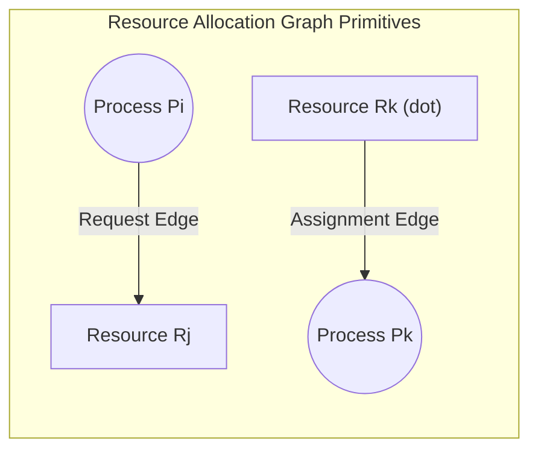
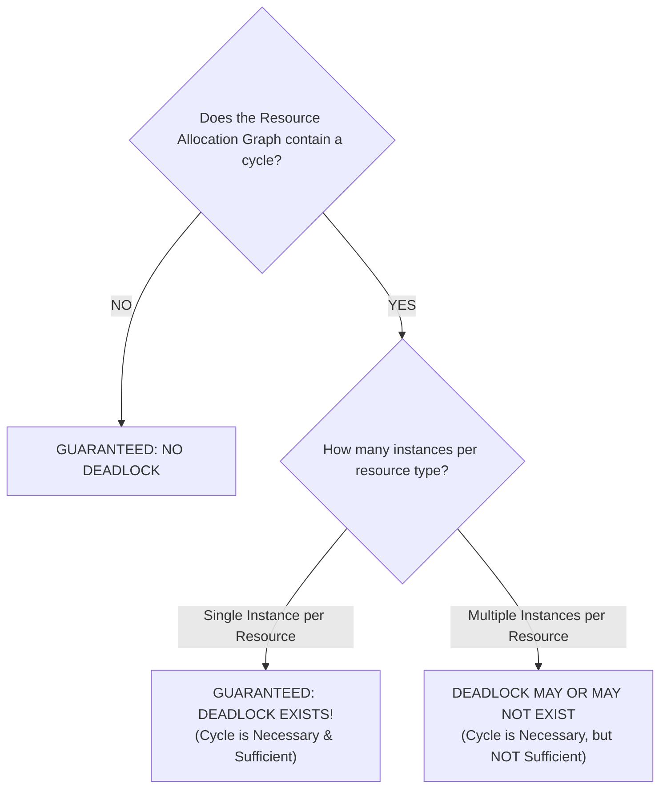
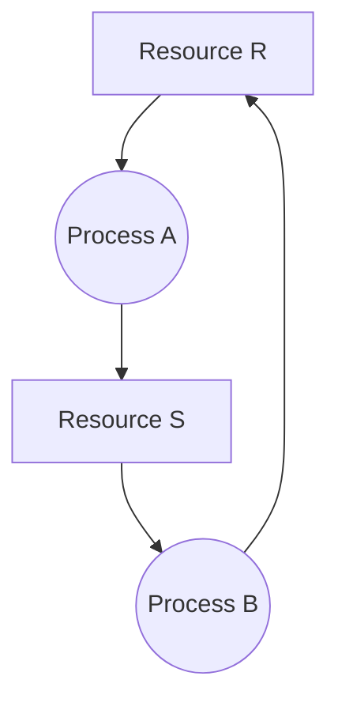
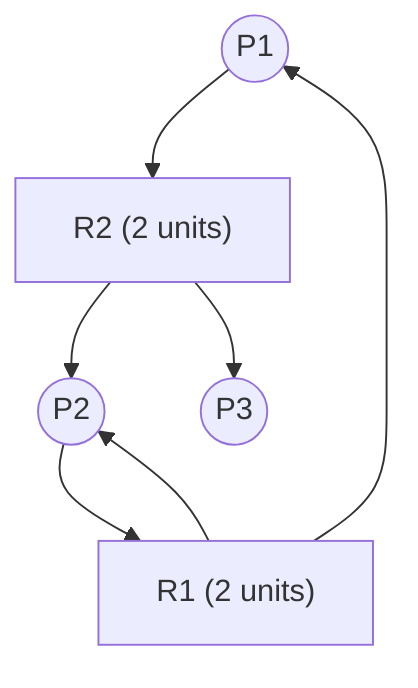

# Resource Allocation Graphs and Deadlock Modeling

> 📖 **Reading Order:** Step 27 of 34 | **Module 5:** Deadlocks  
> ◄ **Previous:** [[Deadlock Fundamentals and Coffman Conditions]] | ► **Next:** [[Deadlock Prevention and Avoidance Strategies]]

---

## 1. Graph Theoretical Formulation

Holt (1972) modeled resource allocation and deadlocks as a directed bipartite graph:
$$G = (V, E)$$

### Vertex Set $V = P \cup R$:
- **Process Nodes ($P$):** Represented visually as circles:
  $$P = \{P_1, P_2, \dots, P_n\}$$
- **Resource Nodes ($R$):** Represented visually as rectangles/squares:
  $$R = \{R_1, R_2, \dots, R_m\}$$
  Dots inside a rectangle indicate the number of identical available **instances** (units) of that resource type.

### Directed Edge Set $E$:
- **Request Edge ($P_i \to R_j$):** A directed arrow from process $P_i$ to resource class $R_j$. Signifies that $P_i$ is currently blocked waiting for an instance of $R_j$.
- **Assignment Edge ($R_j \to P_i$):** A directed arrow from a specific instance dot inside $R_j$ to process $P_i$. Signifies that the resource instance has been granted to and is currently held by $P_i$.

---

## 2. The Fundamental Cycle vs Deadlock Theorems

The relationship between graph cycles and deadlocks depends strictly on the number of instances per resource class:

### Theorem 1: Single-Instance Systems
> In a system where every resource type contains exactly **one single instance**, a directed cycle in the Resource Allocation Graph is both a **necessary and sufficient** condition for deadlock.
> $$\text{Cycle} \iff \text{Deadlock}$$

### Theorem 2: Multi-Instance Systems
> In a system where resource types contain **multiple instances**, a directed cycle is a **necessary condition, but NOT a sufficient condition** for deadlock.
> $$\text{Deadlock} \implies \text{Cycle} \quad (\text{Cycle} \centernot\implies \text{Deadlock})$$

---

## 3. Concrete Visual Examples

### Case A: Single-Instance Cycle $\implies$ Permanent Deadlock
Consider processes $A, B$ and resources $R, S$ (1 instance each):
- Process $A$ holds Resource $R$ and requests Resource $S$.
- Process $B$ holds Resource $S$ and requests Resource $R$.

Cycle: $A \to S \to B \to R \to A$. Neither $A$ nor $B$ can proceed. **Definite Deadlock.**

---

### Case B: Multi-Instance Cycle $\implies$ NO Deadlock (False Alarm)
Consider processes $P_1, P_2, P_3$ and resources $R_1, R_2$ (2 instances each):
- $R_1$ has 2 instances: held by $P_1$ and $P_2$.
- $R_2$ has 2 instances: held by $P_2$ and $P_3$.
- $P_1$ requests an instance of $R_2$ ($P_1 \to R_2$).
- $P_2$ requests an instance of $R_1$ ($P_2 \to R_1$).
- **Cycle exists:** $P_1 \to R_2 \to P_2 \to R_1 \to P_1$.

**Why there is NO Deadlock:**
Notice Process $P_3$! $P_3$ holds an instance of $R_2$, but $P_3$ is **not waiting for any resource**.
1. $P_3$ executes independently and finishes.
2. $P_3$ releases its instance of $R_2$.
3. The released instance of $R_2$ is allocated to $P_1$, fulfilling $P_1$'s request!
4. $P_1$ executes to completion and releases its resources.
5. Finally, $P_2$ completes.
The cycle dissolved completely!

---

## 4. Graph Reduction Algorithm

To formally verify whether a multi-instance graph is deadlocked, the OS executes **Graph Reduction**:

### Step-by-Step Reduction Protocol:
1. Search for a process node $P_i$ whose pending resource requests can be completely satisfied by the currently available unassigned resource instances.
2. If such a $P_i$ is found, assume $P_i$ runs to completion without blocking:
   - Erase all request edges from $P_i$.
   - Erase all assignment edges to $P_i$ (returning its held instances to the available pool).
   - Erase node $P_i$.
3. Repeat Steps 1 and 2 until no further process can be satisfied.
4. **Termination Criteria:**
   - If **all process nodes are erased**, the graph is completely reducible $\implies$ **No Deadlock**.
   - If **non-empty process nodes remain**, the system is deadlocked, and the remaining processes are the ones deadlocked!

---

## Source Traceability & Metadata
- **Source Material:** `5. Deadlocks-week6-7-RRR.pdf` (Slides 10–13, 16–17: Deadlock Modeling, Resource Allocation Graphs, Cycle Analysis).
- **Previous Topic:** [[Deadlock Fundamentals and Coffman Conditions]] (Step 26).
- **Next Topic:** [[Deadlock Prevention and Avoidance Strategies]] (Step 28).
