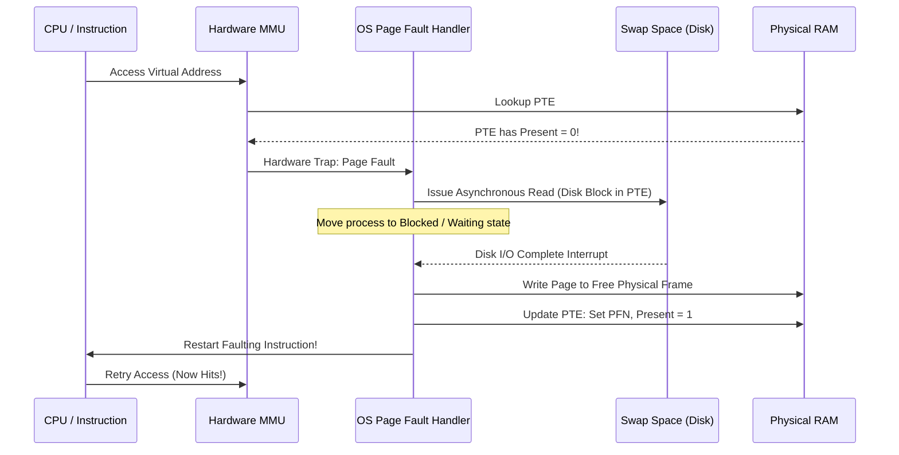

# Swapping Mechanisms and Page Fault Handling

> 📖 **Reading Order:** Step 45 of 68 | **Module 7: Paging & Virtual Memory Systems**  
> ◄ **Previous:** [[Multi-Level Page Tables and Advanced Address Translation]] | ► **Next:** [[Page Replacement Policies and the Clock Algorithm]]

---

## Starting Point and the Problem

All virtual memory techniques explored so far—Base and Bounds, Segmentation, and Paging—assume that every active page of a process resides in physical RAM.

However, physical RAM is strictly finite (e.g., 8 GB or 16 GB). If multiple large processes run concurrently, their combined active memory footprints easily exceed total physical memory. In the absence of a secondary storage mechanism, the OS would have to terminate processes or refuse to launch new programs.

---

## Developing the Idea: The Memory Hierarchy and Swap Space

To create the illusion of an address space larger than physical memory, the operating system utilizes secondary storage (Hard Disks or SSDs) as an overflow reservoir: the **Swap Space**.

The OS divides a dedicated disk partition into page-sized blocks. When physical RAM fills up, the OS evicts less active pages to swap space, freeing physical frames for active instructions.



---

## How It Works: The Page Fault Lifecycle

Address translation with swapping hinges on the **Present Bit** in the Page Table Entry:
- If $\text{Present} == 1$, the page resides in physical RAM $\to$ MMU completes translation.
- If $\text{Present} == 0$, the page resides on secondary disk storage $\to$ hardware raises a **Page Fault**.

### Detailed Step-by-Step Execution Sequence:
1. **Instruction Execution:** CPU attempts to fetch an instruction or access data at virtual address `VA`.
2. **Hardware Exception:** MMU inspects the PTE, discovers $\text{Present} == 0$, halts the instruction, and triggers a **Page Fault Exception Trap**.
3. **OS Trap Handler Invocation:** Control transfers to the kernel's Page Fault Handler.
4. **Extracting Disk Location:** The OS examines the PTE. When $\text{Present} == 0$, the hardware ignores the PFN field; the OS repurposes these bits to store the **Swap Disk Block Address**.
5. **Frame Allocation & Eviction:** The OS searches for a free physical memory frame. If physical memory is completely full, the OS invokes a [[Page Replacement Policies and the Clock Algorithm|Page Replacement Policy]] to select a victim page, write it to disk if dirty, and reclaim its frame.
6. **Disk I/O Issue:** The OS issues an I/O request to read the desired page from swap space into the newly allocated physical frame.
7. **Process State Transition:** Because disk I/O requires milliseconds, the faulting process is placed into the **Waiting / Blocked** state, and the CPU scheduler context-switches to run another Ready process.
8. **I/O Completion Interrupt:** When the disk transfer finishes, a hardware I/O interrupt fires. The OS updates the faulting process's PTE: it writes the physical frame number into the PFN field, sets $\text{Present} = 1$, and moves the process back to the **Ready** queue.
9. **Instruction Restart:** When scheduled, the process restarts the *exact instruction that triggered the fault*. The CPU re-executes the access, hits in the PTE, and proceeds without error!

---

## Page Replacement Daemon and Memory Watermarks

Performing page eviction directly inside the page fault handler forces the faulting process to wait for *two* slow disk operations (one to write the dirty victim page out, and one to read the new page in).

To keep a steady supply of free frames available, modern operating systems run a background kernel daemon (`kswapd` in Linux) governed by **Memory Watermarks**:

```
Physical Memory Allocation Levels:
+------------------------------------------+ Top of RAM
| High Watermark (HW)                      |
|                                          | (Normal operation: plenty of free frames)
+------------------------------------------+
| Low Watermark (LW)                       | <-- kswapd wakes up when free memory drops here!
|                                          | (kswapd actively evicts pages to reach HW)
+------------------------------------------+
| Min / Critical Level                     | <-- Synchronous blocking allocation
+------------------------------------------+ 0 MB
```

- When free pages fall below the **Low Watermark ($LW$)**, the swap daemon wakes up in the background and begins evicting pages until free memory rises back to the **High Watermark ($HW$)**.
- This ensures allocation requests almost always find an immediately available free frame.

---

## Important Properties and Why They Hold

- **Instruction Restartability Invariant:** To support virtual memory swapping, CPU architectures must save internal microarchitectural register states upon faults so that partially executed instructions (e.g., auto-incrementing registers or complex CISC memory moves) can be restarted cleanly without side effects.
- **PTE Dual-Semantics Principle:** When $\text{Present} == 1$, the entry stores physical silicon frame coordinates; when $\text{Present} == 0$, the entry stores storage block sector coordinates.

---

## Common Mistakes

- **Confusing Segmentation Fault with Page Fault:**
  - A **Segmentation Fault** is an illegal memory access (e.g., dereferencing an unmapped address or writing to read-only code). It is fatal and results in process termination.
  - A **Page Fault** is a normal, expected architectural event indicating that a valid virtual page currently resides on secondary storage. It is handled transparently by the OS.
- **Ignoring the Cost of Dirty Evictions:** Evicting a clean page costs 0 disk writes (it can simply be discarded and re-read from disk later). Evicting a dirty page requires an expensive disk write.

---

## Exam Relevance

Key examination topics include:
- Drawing and explaining the complete step-by-step page fault handling sequence.
- Explaining how the OS distinguishes an invalid access (segfault) from a swapped-out page (page fault).
- Describing the role of high and low memory watermarks and the background swap daemon.

---

## Related Concepts

- [[Paging Architecture and Linear Page Tables]]
- [[Multi-Level Page Tables and Advanced Address Translation]]
- [[Page Replacement Policies and the Clock Algorithm]]

---

## Prerequisites

- [[Paging Architecture and Linear Page Tables]]
- [[Multi-Level Page Tables and Advanced Address Translation]]

---

## Problems

- [[Problem — Multi-Level Paging and Page Replacement Simulation]]

---

## Sources

- **Lecture Slides:** [[cse313/01 - Sources/Lectures/CSE313_KRV_Merged.pdf|CSE313_KRV_Merged.pdf]], Chapter 21 (Slides 176–186).
- **Textbook:** Arpaci-Dusseau & Arpaci-Dusseau, *Operating Systems: Three Easy Pieces (OSTEP)*, Chapter 21 (Beyond Physical Memory: Mechanisms).
