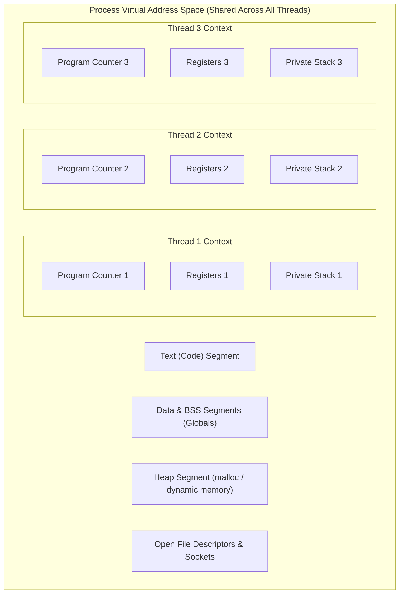
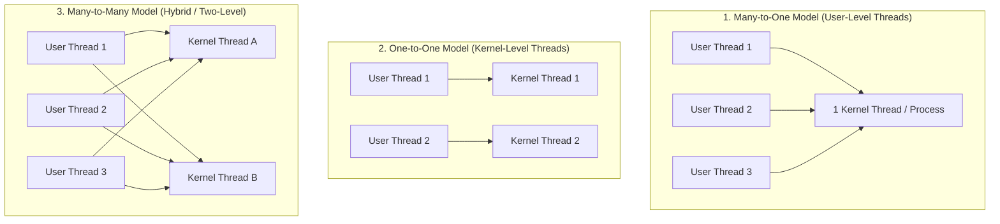

# Threads and Multithreading Models

> 📖 **Reading Order:** Step 08 of 68 | **Module 2:** Processes & Threads  
> ◄ **Previous:** [[Process Creation and Termination Operations]] | ► **Next:** [[CPU Multiprogramming Utilization Formula]]

---
> [!IMPORTANT] 🎯 **Exam Frequency & Intelligence (Appeared in 2017 Q1d, 2019 Q4b, 2019 Q4c, 2020 Q1c, 2020 Q2c, 2021 Q1b, 2021 Q3c)**
> **Frequency:** ⭐⭐⭐⭐⭐ **100% Core Recurrence (Appeared across all 5 exam years!)**
>
> ### What Exam Questions Expect & How to Master Them:
> 1. **PCS vs TCS Differentiation & Item Classification (2019 Q4b, 2020 Q1c, 2021 Q3c):**
>    - **Process Contention Scope (PCS):** Competition for execution time occurs *strictly among threads belonging to the same process*. Scheduled by user-level runtime library onto available LWPs (Many-to-One and Many-to-Many models).
>    - **Thread Contention Scope (TCS):** Competition occurs *globally across all threads in the entire operating system*. Scheduled directly by the OS kernel onto physical CPU cores (One-to-One model, e.g., Linux Pthreads).
>    - **Item Classification (Shared vs Private):**
>      - *Per-Thread Private:* Program Counter (PC), CPU Registers, Stack Pointer & Call Stack, Thread ID (TID), Thread-Local Storage (TLS).
>      - *Per-Process Shared:* Address space (Text, Data, BSS, Heap), Global variables, Open file descriptors, Child processes, Signal handlers, Accounting info.
> 2. **Why Blocking I/O Blocks Entire Process in ULT but Not KLT (2019 Q4c, 2021 Q1b):**
>    - **User-Level Threads (ULT):** The kernel is completely unaware of individual threads; it only tracks the single enclosing Process Control Block (PCB). When a thread executes a blocking system call (e.g., `read()`), the kernel transitions the *entire PCB* into the `SLEEPING` state. All sibling user threads are frozen.
>    - **Kernel-Level Threads (KLT):** Each thread has an independent kernel thread descriptor and kernel stack. When a thread blocks, the kernel suspends *only that individual thread* and immediately schedules other runnable threads belonging to the same process.
> 3. **Advantages of Hybrid ($M:N$) Multithreading (2017 Q1d):**
>    - Ultra-fast user-space thread switching without kernel trap overhead.
>    - True multiprocessor parallel execution across multiple cores.
>    - Non-blocking: if one user thread blocks, the user-space scheduler switches runnable user threads onto remaining available kernel threads.

---
## Starting Point and the Problem

Modern CPUs feature multi-core architectures capable of executing multiple instruction streams in parallel. While spawning separate processes enables concurrency, every process requires its own private address space, page tables, open file tables, and PCB.

We want concurrent tasks within an application (e.g. rendering UI, spell-checking text, and downloading files in a document editor) to cooperate with minimal creation and context-switch overhead, while directly sharing common memory data structures. The central obstacle is that traditional process isolation makes memory sharing slow and cumbersome, requiring explicit IPC channels and frequent kernel boundary crossings.

---
## Developing the Idea

To enable lightweight concurrency within a single application, the OS decomposes the process abstraction into two separate units:
1. **Resource Grouping Unit (The Process):** Holds the address space, open files, global variables, and heap memory.
2. **Execution Unit (The Thread):** Holds only the minimal state needed to execute instructions independently: a Program Counter (PC), CPU registers, and an independent call stack.

All threads belonging to the same process share the identical address space and heap. This enables blazing-fast communication via shared variables, but introduces synchronization risks: threads can overwrite each other's data if not synchronized.

---
## Definition

A **thread** (often called a **Lightweight Process (LWP)**) is the smallest basic unit of CPU execution and scheduling within an operating system.

While a traditional **process** owns both a virtual memory address space AND an execution stream, modern systems decouple these concepts:
- **Process:** The unit of **resource ownership** (owns an allocated virtual address space, file descriptor table, and security context).
- **Thread:** The unit of **CPU dispatch and execution** (owns an independent Program Counter, register state, and private call stack).

A process may contain a single thread of execution (single-threaded) or multiple concurrent threads executing in parallel across shared memory (multithreaded).

---
## How It Works

### Multithreading Implementation Models

Multithreading can be implemented at the **User Level** (via user-space libraries) or at the **Kernel Level** (supported natively by the OS). This leads to three distinct mapping models:

### 1. Many-to-One Model (User-Level Threads / Green Threads)
- **Mechanism:** Thread management is handled entirely in user space by a thread library (e.g., GNU Portable Threads, legacy Java Green Threads). The kernel sees only a single traditional process.
- **Advantages:** Thread creation, destruction, and context switches are ultra-fast (executed as simple local function calls with zero system call overhead).
- **Disadvantages:**
  - If any single user thread executes a blocking system call (e.g., `read()`), the **entire process blocks**, suspending all other user threads.
  - The kernel cannot assign different user threads to different physical CPU cores; no true multicore parallelism.

### 2. One-to-One Model (Kernel-Level Threads)
- **Mechanism:** Every user-level thread is paired 1-to-1 with a distinct kernel-level execution entity. The kernel is fully aware of every thread and schedules each thread independently.
- **Advantages:**
  - True multicore hardware parallelism: multiple threads run simultaneously on separate cores.
  - If one thread blocks on I/O, other threads continue running unimpeded.
- **Disadvantages:**
  - Creating each user thread requires a kernel system call and a kernel PCB/thread struct allocation.
  - Context switching requires crossing the user-kernel privilege boundary.
- **Modern Dominance:** Standard in Linux (`NPTL` / `pthreads`), Windows, macOS, and iOS.

### 3. Many-to-Many Model & Two-Level Model
- **Mechanism:** Multiplexes $M$ user threads onto $N$ kernel threads, where $M \ge N$.
- **Advantages:** Combines fast user-space switching with non-blocking kernel concurrency.
- **Disadvantages:** Extremely complex to implement; requires continuous kernel-to-user coordination (scheduler activations).

---
## Example

A multithreaded web server:
- Main thread listens on TCP socket port 80.
- When an incoming connection arrives, rather than calling heavyweight `fork()`, the server spawns a lightweight worker thread:
  `pthread_create(&tid, NULL, handle_client, (void*)client_sock);`
- The worker thread reads files from the shared memory cache and writes to the client socket.
- Context switching between worker threads avoids TLB invalidation because both threads share the same page table.

---
## Technical Details

See related modules for microarchitectural implementation details.

---
## Important Properties and Why They Hold

- **Shared vs. Private State Invariant:** Threads share Code, Data, Heap, and File Descriptors, but maintain strictly private Stacks, Program Counters, and Register sets.
- **Fault Vulnerability:** Because threads share an unprotected address space, an invalid memory write or segmentation fault in one thread crashes the entire parent process and all its sibling threads.
- **Context Switch Efficiency:** Thread switching is substantially faster than process switching because memory page tables (CR3 register) remain unchanged, preserving CPU cache and TLB warm states.

---
## Common Mistakes

1. **Race Conditions on Shared Memory:**
   - Because all threads share the heap and data segments, concurrent unsynchronized reads and writes cause silent memory corruption (see [[Race Conditions and Critical-Section Problem]]).
2. **`fork()` in a Multithreaded Program:**
   - If a multithreaded process calls `fork()`, does the child process clone *all* threads or *only the calling thread*?
   - In POSIX, `fork()` clones **only the calling thread**. If other threads were holding mutex locks at the moment of `fork()`, those mutexes remain locked forever in the child, causing immediate deadlocks!
3. **Stack Overflow across Threads:**
   - Each thread is allocated a private stack inside the process's virtual address space. Because multiple stacks share the space, stack sizes are fixed and smaller (often 1–2 MB), increasing the danger of thread stack overflows colliding with neighbor stacks.

---
## Exam Relevance

- **Next Step:** How does the degree of multiprogramming and thread concurrency affect total CPU throughput? (See [[CPU Multiprogramming Utilization Formula]]).
- **Synchronization:** Thread safety demands mutual exclusion locks and semaphores (see [[Semaphores and Synchronization Primitives]]).
- **Exam Testing:** Universal exam favorite:
  - "Construct a table comparing a Process with a Thread."
  - "List items that threads share vs items that are private to each thread."
  - "Contrast the Many-to-One and One-to-One multithreading models."

---
## Related Concepts

- [[Race Conditions and Critical-Section Problem]]
- [[Semaphores and Synchronization Primitives]]
- [[Monitors and Condition Variables]]

---
## Prerequisites

- [[Process Concepts and Memory Layout]]
- [[Process Control Block and Context Switching]]

---
## Problems

- [[Problem — Dining Philosophers Deadlock-Free Synchronization]]

---
## Sources

- **Lectures:** `cse313/01 - Sources/Lectures/2. ProcessAndThread-week2-RRR.pdf` (Slides 29–42)
- **Textbook:** Andrew S. Tanenbaum & Herbert Bos, *Modern Operating Systems* (4th Edition), Chapter 2 (Section 2.2: Threads)
