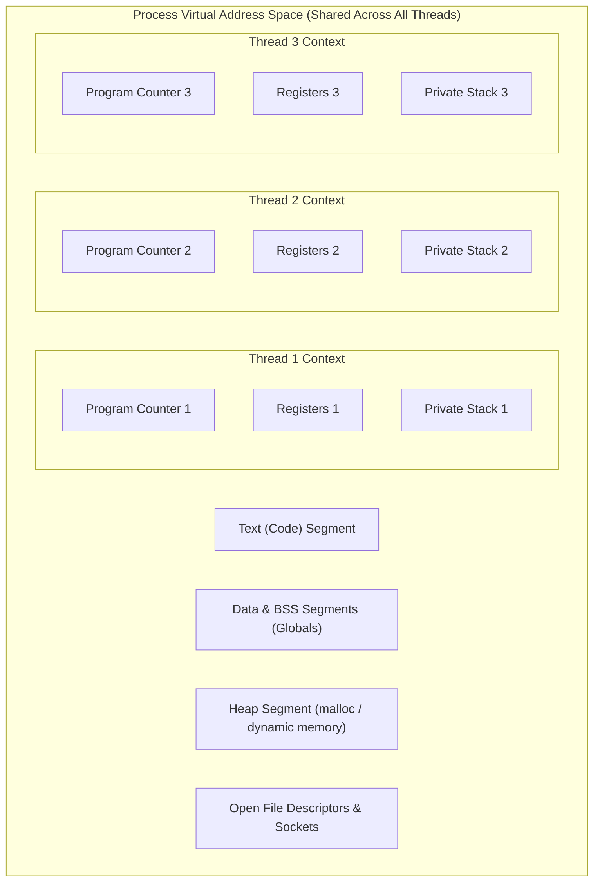
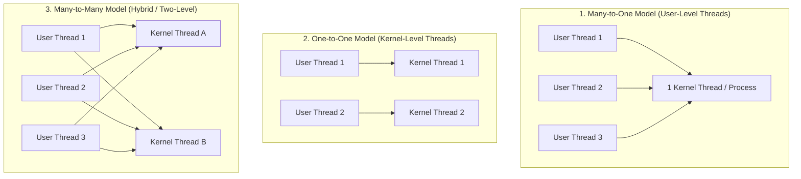

# Threads and Multithreading Models

> 📖 **Reading Order:** Step 08 of 34 | **Module 2:** Processes & Threads  
> ◄ **Previous:** [[Process Creation and Termination Operations]] | ► **Next:** [[CPU Multiprogramming Utilization Formula]]

---

## Definition

A **thread** (often called a **Lightweight Process (LWP)**) is the smallest basic unit of CPU execution and scheduling within an operating system.

While a traditional **process** owns both a virtual memory address space AND an execution stream, modern systems decouple these concepts:
- **Process:** The unit of **resource ownership** (owns an allocated virtual address space, file descriptor table, and security context).
- **Thread:** The unit of **CPU dispatch and execution** (owns an independent Program Counter, register state, and private call stack).

A process may contain a single thread of execution (single-threaded) or multiple concurrent threads executing in parallel across shared memory (multithreaded).

---

## What Do Threads Share vs. What Is Private?

Understanding the boundary between shared and private thread state is critical for synchronization and programming:

| Shared Across All Threads in a Process | Strictly Private to Each Individual Thread |
|---|---|
| **Text Segment** (Executable code instructions) | **Thread ID (TID)** (Unique numeric identifier) |
| **Data & BSS Segments** (Global and static variables) | **Program Counter (PC)** (Current execution location) |
| **Heap Segment** (All dynamically allocated memory) | **CPU Register Set** (Accumulator, index registers, flags) |
| **Open File Descriptors** (Read/write offsets, files) | **Private Call Stack** (Local variables, return addresses) |
| **Child Processes** (Created via `fork()`) | **Stack Pointer (SP)** (Points to thread's active stack top) |
| **Signal Handlers & Permissions** (UID, GID, umask) | **Scheduling Priority & State** (Ready, Running, Blocked) |

---

## Motivation for Multithreading (The 4 Benefits)

1. **Responsiveness (Non-blocking I/O):**
   - In a web browser or GUI text editor, a single-threaded process freezes entirely while waiting for a network download or disk write.
   - In a multithreaded application, one worker thread handles the slow network request while the main UI thread remains completely responsive to user keystrokes and clicks.
2. **Resource Sharing:**
   - Processes can only communicate through heavyweight IPC mechanisms (pipes, shared memory segments, message queues; see [[Message Passing and IPC Models]]).
   - Threads automatically share all memory (globals, heap, arrays) by default, enabling zero-copy data passing.
3. **Economy (Lightweight Creation & Switching):**
   - Creating a thread is **10 to 30 times faster** than creating a process because no new address space or page tables need to be allocated.
   - A thread context switch requires saving only CPU registers and stack pointers. It does **NOT** require reloading MMU page tables, avoiding expensive TLB flushes and cache invalidation.
4. **Utilization of Multiprocessor Architectures:**
   - On a multi-core CPU, distinct threads of the same process can execute **simultaneously in true hardware parallelism** on different physical cores. A single-threaded process can only ever utilize a single core (e.g., $25\%$ of a quad-core CPU).

---

## Multithreading Implementation Models

Multithreading can be implemented at the **User Level** (via user-space libraries) or at the **Kernel Level** (supported natively by the OS). This leads to three distinct mapping models:

### 1. Many-to-One Model (User-Level Threads / Green Threads)
- **Mechanism:** Thread management is handled entirely in user space by a thread library (e.g., GNU Portable Threads, legacy Java Green Threads). The kernel sees only a single traditional process.
- **Advantages:** Thread creation, destruction, and context switches are ultra-fast (executed as simple local function calls with zero system call overhead).
- **Disadvantages:**
  - If any single user thread executes a blocking system call (e.g., `read()`), the **entire process blocks**, suspending all other user threads.
  - The kernel cannot assign different user threads to different physical CPU cores; no true multicore parallelism.

### 2. One-to-One Model (Kernel-Level Threads)
- **Mechanism:** Every user-level thread is paired 1-to-1 with a distinct kernel-level execution entity. The kernel is fully aware of every thread and schedules each thread independently.
- **Advantages:**
  - True multicore hardware parallelism: multiple threads run simultaneously on separate cores.
  - If one thread blocks on I/O, other threads continue running unimpeded.
- **Disadvantages:**
  - Creating each user thread requires a kernel system call and a kernel PCB/thread struct allocation.
  - Context switching requires crossing the user-kernel privilege boundary.
- **Modern Dominance:** Standard in Linux (`NPTL` / `pthreads`), Windows, macOS, and iOS.

### 3. Many-to-Many Model & Two-Level Model
- **Mechanism:** Multiplexes $M$ user threads onto $N$ kernel threads, where $M \ge N$.
- **Advantages:** Combines fast user-space switching with non-blocking kernel concurrency.
- **Disadvantages:** Extremely complex to implement; requires continuous kernel-to-user coordination (scheduler activations).

---

## Edge Cases & Pitfalls

1. **Race Conditions on Shared Memory:**
   - Because all threads share the heap and data segments, concurrent unsynchronized reads and writes cause silent memory corruption (see [[Race Conditions and Critical-Section Problem]]).
2. **`fork()` in a Multithreaded Program:**
   - If a multithreaded process calls `fork()`, does the child process clone *all* threads or *only the calling thread*?
   - In POSIX, `fork()` clones **only the calling thread**. If other threads were holding mutex locks at the moment of `fork()`, those mutexes remain locked forever in the child, causing immediate deadlocks!
3. **Stack Overflow across Threads:**
   - Each thread is allocated a private stack inside the process's virtual address space. Because multiple stacks share the space, stack sizes are fixed and smaller (often 1–2 MB), increasing the danger of thread stack overflows colliding with neighbor stacks.

---

## Cross-Topic Connections / Exam Relevance

- **Next Step:** How does the degree of multiprogramming and thread concurrency affect total CPU throughput? (See [[CPU Multiprogramming Utilization Formula]]).
- **Synchronization:** Thread safety demands mutual exclusion locks and semaphores (see [[Semaphores and Synchronization Primitives]]).
- **Exam Testing:** Universal exam favorite:
  - "Construct a table comparing a Process with a Thread."
  - "List items that threads share vs items that are private to each thread."
  - "Contrast the Many-to-One and One-to-One multithreading models."

---

## Sources & Traceability

- **Lectures:** `cse313/01 - Sources/Lectures/2. ProcessAndThread-week2-RRR.pdf` (Slides 29–42)
- **Textbook:** Andrew S. Tanenbaum & Herbert Bos, *Modern Operating Systems* (4th Edition), Chapter 2 (Section 2.2: Threads)
