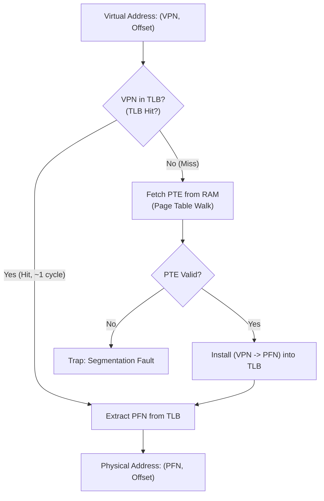

# Translation Lookaside Buffers and Hardware Caching

> 📖 **Reading Order:** Step 43 of 68 | **Module 7: Paging & Virtual Memory Systems**  
> ◄ **Previous:** [[Paging Architecture and Linear Page Tables]] | ► **Next:** [[Multi-Level Page Tables and Advanced Address Translation]]

---

## Starting Point and the Problem

As established in [[Paging Architecture and Linear Page Tables]], paging provides clean memory virtualization with zero external fragmentation, but it imposes a severe performance tax:
> **Every single instruction and data reference requires an extra memory access to fetch its PTE from RAM before accessing the actual data.**

Because reading from motherboard physical RAM takes tens of nanoseconds (dozens of CPU clock cycles), doubling the number of memory references cuts processor throughput roughly in half!

To make virtual memory practical, address translation must complete in a single clock cycle.

---

## Developing the Idea: The Translation Cache

The solution is a specialized hardware cache located directly inside the CPU Memory Management Unit (MMU): the **Translation Lookaside Buffer (TLB)**.

The TLB stores recently accessed $\text{VPN} \to \text{PFN}$ translations. When the CPU generates a virtual address, the MMU checks the TLB first:
- **TLB Hit:** The translation is present in the cache. The MMU extracts the PFN directly in $\le 1$ clock cycle without touching RAM.
- **TLB Miss:** The translation is not in the cache. The CPU must walk the in-memory page table, load the PTE into the TLB, and retry the instruction.



### Why TLBs Achieve $>99\%$ Hit Rates: Locality
TLBs succeed because program execution exhibits profound **Locality of Reference**:
1. **Temporal Locality:** An instruction or variable accessed now is likely to be accessed again in the near future (e.g., loop variables, function code).
2. **Spatial Locality:** Accessing memory at address $A$ makes accessing address $A+1$ highly probable (e.g., sequential instruction execution, array iterations).

---

## Hardware-Managed vs. Software-Managed TLBs

Architectures handle TLB misses in two distinct ways:

### 1. Hardware-Managed TLB (CISC / x86)
- The CPU hardware knows the exact in-memory tree structure of the page table.
- A privileged control register (e.g., `CR3` on x86) stores the physical address of the Page Directory / Table.
- **On a Miss:** The hardware MMU automatically walks the page table levels in RAM, extracts the PFN, inserts it into the TLB, and resumes execution—all without invoking the OS kernel!

### 2. Software-Managed TLB (RISC / MIPS, SPARC, ARM)
- The hardware MMU does not know or care about page table formats.
- **On a Miss:** The hardware halts instruction execution and raises a fast **TLB Miss Exception Trap** to the OS.
- The OS kernel's low-level trap handler executes a few assembly instructions to look up the PTE in its software structures, executes a privileged instruction (e.g., `tlb_write`) to load the translation into the TLB, and returns from the trap.
- **Advantages:** The OS can use any page table format it desires (linear, inverted, hash-based, tree); hardware MMU silicon remains small and simple.

---

## The Context Switch Dilemma: Flushes vs. ASID

A critical issue arises during context switches:
> The VPN $\to$ PFN translations stored in the TLB belong to the *outgoing process*. If Process $B$ runs, virtual address `0x1000` must NOT translate to the physical frame belonging to Process $A$!

Two architectural solutions exist:

### Approach 1: Flushing the TLB on Every Context Switch
- On each context switch, the OS clears all valid bits in the TLB to 0.
- **Drawback:** When the incoming process begins, it incurs a storm of TLB misses until its working set is reloaded into cache, degrading context switch performance.

### Approach 2: Address Space Identifiers (ASID)
- The hardware TLB adds an **ASID field** (typically 8 to 12 bits) to every TLB entry, representing the process identifier (PID).
- The MMU only reports a TLB hit if $\text{TLB.VPN} == \text{VPN}$ **AND** $\text{TLB.ASID} == \text{Current\_PID}$.
- Multiple processes can share the TLB simultaneously without flushes!

```
TLB Entry Format with ASID:
+---------+---------+------+-------+-------+
|  ASID   |   VPN   | PFN  | Valid | Prot  |
+---------+---------+------+-------+-------+
|   12    | 0x00010 | 0x07 |   1   |  R-W  | -> Process 12
|   15    | 0x00010 | 0x09 |   1   |  R-W  | -> Process 15 (Distinct frame!)
+---------+---------+------+-------+-------+
```

---

## Example: Tracing TLB Hits on an Array Access

Suppose a 10-element integer array `a[10]` (each integer 4 bytes, total 40 bytes) is allocated starting at virtual address `100` on a system with 16-byte pages ($2^4 \implies \text{Offset}=4$ bits).
- Page 6 covers bytes $96$ to $111$ (contains `a[0]` to `a[2]`).
- Page 7 covers bytes $112$ to $127$ (contains `a[3]` to `a[6]`).
- Page 8 covers bytes $128$ to $143$ (contains `a[7]` to `a[9]`).

Iterating through the array:
- `a[0]` (Addr 100, Page 6): **TLB Miss** $\to$ loads Page 6 into TLB.
- `a[1]` (Addr 104, Page 6): **TLB Hit!**
- `a[2]` (Addr 108, Page 6): **TLB Hit!**
- `a[3]` (Addr 112, Page 7): **TLB Miss** $\to$ loads Page 7 into TLB.
- `a[4]` (Addr 116, Page 7): **TLB Hit!**
- `a[5]` (Addr 120, Page 7): **TLB Hit!**
- `a[6]` (Addr 124, Page 7): **TLB Hit!**
- `a[7]` (Addr 128, Page 8): **TLB Miss** $\to$ loads Page 8 into TLB.
- `a[8]` (Addr 132, Page 8): **TLB Hit!**
- `a[9]` (Addr 136, Page 8): **TLB Hit!**

Out of 10 accesses: 3 misses and 7 hits $\implies \mathbf{70\% \text{ Hit Rate}}$ even on a tiny 40-byte array! For 4 KB pages containing 1,024 integers, the hit rate reaches $\mathbf{99.9\%}$.

---

## Important Properties and Why They Hold

- **Spatial Locality Scaling Theorem:** As page size increases, spatial locality coverage per TLB entry increases linearly, reducing miss frequency for sequential workloads.
- **TLB Consistency Invariant:** Whenever the OS modifies a PTE in memory (e.g., swapping a page out or remapping a frame), it must issue a **TLB Invalidation / Shootdown** instruction (`invlpg` on x86) to purge stale translations from CPU TLBs.

---

## Common Mistakes

- **Confusing TLB Miss with Page Fault:**
  - A **TLB Miss** means the translation is not cached in the TLB; the page may still reside comfortably in physical RAM.
  - A **Page Fault** means the page is NOT in physical RAM (its PTE has `Present = 0`), requiring slow disk I/O.
- **Overlooking Multi-Core TLB Shootdowns:** On multicore processors, modifying a shared page table requires sending Inter-Processor Interrupts (IPIs) to force all cores to invalidate their local TLBs.

---

## Exam Relevance

Frequently tested via:
- Calculating Effective Access Time (EAT) given hit rate, TLB search time, and memory latency.
- Tracing array traversals and computing hit/miss sequences.
- Comparing hardware-managed vs software-managed TLB trade-offs.

---

## Related Concepts

- [[Paging Architecture and Linear Page Tables]]
- [[Multi-Level Page Tables and Advanced Address Translation]]
- [[Virtual Memory Performance and Address Translation Formulas]]

---

## Prerequisites

- [[Paging Architecture and Linear Page Tables]]

---

## Problems

- [[Problem — Multi-Level Paging and Page Replacement Simulation]]

---

## Sources

- **Lecture Slides:** [[cse313/01 - Sources/Lectures/CSE313_KRV_Merged.pdf|CSE313_KRV_Merged.pdf]], Chapter 19 (Slides 129–145).
- **Textbook:** Arpaci-Dusseau & Arpaci-Dusseau, *Operating Systems: Three Easy Pieces (OSTEP)*, Chapter 19 (Paging: Faster Translations (TLBs)).
