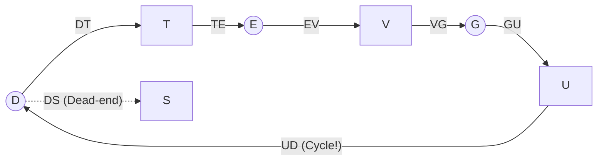
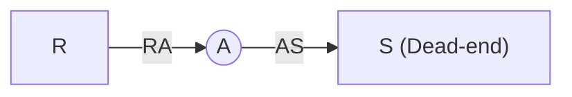

# Resource Allocation Graph Cycle Detection Example

> 📖 **Reading Order:** Step 32 of 34 | **Module 5:** Deadlocks  
> ◄ **Previous:** [[Banker's Algorithm Multi-Resource Step-by-Step Example]] | ► **Next:** [[Problem — Banker's Algorithm Safe State and Request Granting]]

---

## 1. Problem Specification & Setup

*(Directly derived from course simulation lecture notes: `Notes on algorithm simulation.pdf` and `5. Deadlocks-week6-7-RRR.pdf`, Slide 17)*

Consider a single-instance Resource Allocation Graph $G = (V, E)$ containing processes and single-unit resources. We execute the Depth-First Search (DFS) deadlock detection algorithm with backtracking for two distinct starting nodes:
1. **Starting Node $D$**
2. **Starting Node $R$**

### Data Structures Maintained:
- **`Initial Node`:** The root of the DFS traversal.
- **`L`:** Ordered list (stack) of nodes visited along the current traversal path.
- **`CN`:** Current Node being expanded.

---

## 2. Simulation Trace 1: Starting Node $D$

### Initial Setup:
- `Initial Node` $\leftarrow D$
- $L = \emptyset$
- $CN \leftarrow D$
- $L = \{D\}$

### Execution Steps:
1. Outgoing unmarked edges of $D$: **$DS$** and **$DT$**.  
   *Choice:* Choose edge $DS$.
   - $L = \{D, S\}$, $CN \leftarrow S$.
2. Node $S$ has **no outgoing edges**, and $S$ is not the initial node:
   - **Backtrack:** Return to previous node $D$ and remove $S$ from $L$.
   - $L = \{D\}$, $CN \leftarrow D$.
3. Outgoing unmarked edges of $D$: **$DT$**.  
   *Choice:* Choose edge $DT$.
   - $L = \{D, T\}$, $CN \leftarrow T$.
4. Outgoing unmarked edge of $T$: **$TE$**.
   - $L = \{D, T, E\}$, $CN \leftarrow E$.
5. Outgoing unmarked edge of $E$: **$EV$**.
   - $L = \{D, T, E, V\}$, $CN \leftarrow V$.
6. Outgoing unmarked edge of $V$: **$VG$**.
   - $L = \{D, T, E, V, G\}$, $CN \leftarrow G$.
7. Outgoing unmarked edge of $G$: **$GU$**.
   - $L = \{D, T, E, V, G, U\}$, $CN \leftarrow U$.
8. Outgoing unmarked edge of $U$: **$UD$**.
   - $L = \{D, T, E, V, G, U, D\}$, $CN \leftarrow D$.
9. **Termination Check:**  
   Node $D$ appears **twice** in list $L$ ($D \in L$ at start and end).

### Conclusion for Node $D$:
The graph contains a directed cycle:
$$\mathbf{D \to T \to E \to V \to G \to U \to D}$$
Because this is a single-instance resource system, **a deadlock strictly exists** involving processes $\{D, E, G\}$ and resources $\{T, V, U\}$.

---

## 3. Simulation Trace 2: Starting Node $R$

### Initial Setup:
- `Initial Node` $\leftarrow R$
- $L = \emptyset$
- $CN \leftarrow R$
- $L = \{R\}$

### Execution Steps:
1. Outgoing unmarked edge of $R$: **$RA$**.
   - $L = \{R, A\}$, $CN \leftarrow A$.
2. Outgoing unmarked edge of $A$: **$AS$**.
   - $L = \{R, A, S\}$, $CN \leftarrow S$.
3. Node $S$ has **no outgoing edges**, and $S$ is not the initial node:
   - **Backtrack:** Return to predecessor $A$, remove $S$ from $L$.
   - $L = \{R, A\}$, $CN \leftarrow A$.
4. Node $A$ has **no further unmarked outgoing edges**, and $A$ is not the initial node:
   - **Backtrack:** Return to predecessor $R$, remove $A$ from $L$.
   - $L = \{R\}$, $CN \leftarrow R$.
5. Node $R$ has **no further unmarked outgoing edges**, and $R$ **is the initial node**:
   - Algorithm halts for this root.

### Conclusion for Node $R$:
$$\mathbf{\text{“No cycle Found.”}}$$
No deadlocked cycles are reachable from starting node $R$.

---

## 4. Key Takeaways & Exam Simulation Rules
1. **Unmarked Edges:** Whenever an edge is traversed, it is marked so it will not be traversed again in the same path.
2. **Backtracking Condition:** When a dead-end node is encountered (no outgoing edges), the node is removed from list $L$, and the current pointer $CN$ retracts to the parent node.
3. **Deadlock Equivalence:** In an exam simulation, you only trace from the specified starting nodes. For complete system safety, the detection algorithm is executed with every node in $V$ as a potential root. If all roots report *"No cycle Found"*, the entire system is deadlock-free.

---

## Source Traceability & Metadata
- **Source Material:** `Notes on algorithm simulation.pdf` (Pages 5–7: Deadlock detection for single resource) and `5. Deadlocks-week6-7-RRR.pdf` (Slide 17).
- **Previous Topic:** [[Banker's Algorithm Multi-Resource Step-by-Step Example]] (Step 31).
- **Next Topic:** [[Problem — Banker's Algorithm Safe State and Request Granting]] (Step 33).
