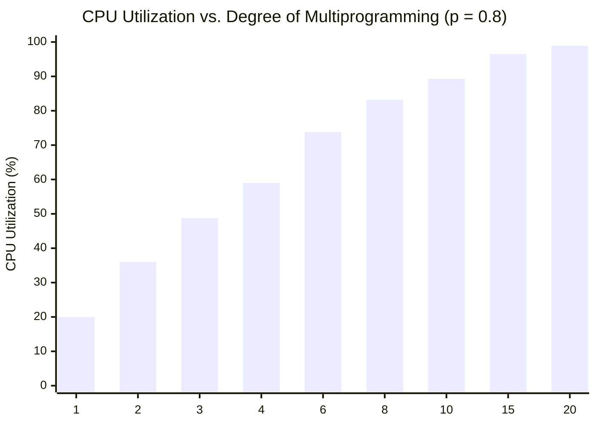

# CPU Multiprogramming Utilization Formula

> 📖 **Reading Order:** Step 09 of 68 | **Module 2:** Processes & Threads  
> ◄ **Previous:** [[Threads and Multithreading Models]] | ► **Next:** [[Process Forking and Zombie Orphan Example]]

---
## The Question and Earlier Knowledge

How much CPU computing capacity is actively utilized when $n$ independent processes are loaded concurrently into main memory, and what fraction of CPU time is wasted idling during I/O waits?

We already know that processes alternate between CPU bursts and I/O bursts. When only a single process is resident in memory ($n=1$), any time it blocks on slow disk or network I/O, the expensive CPU has nothing to do and sits completely idle. The obstacle to calculating multi-process CPU utilization directly is modeling the complex concurrent scheduling interactions among multiple processes without running an intractable minute-by-minute simulation.

---
## Developing the Formula

We model the system using probabilistic analysis:
1. Let $p$ be the average fraction of time each process spends waiting for I/O ($0 \le p \le 1$).
2. For a single process, the probability it is waiting on I/O at any random instant is $p$.
3. Assuming processes behave independently, the probability that **all $n$ processes are simultaneously blocked on I/O** is the product of their individual probabilities: $p \times p \times \dots \times p = p^n$.
4. The CPU is completely idle if and only if every single resident process is blocked on I/O.
5. Therefore, by the complement rule of probability, at least one process is ready to execute with probability $1 - p^n$.

---
## Formula

$$\text{CPU Utilization} = 1 - p^n$$

$$\text{CPU Idle Probability} = p^n$$

---
## Variables

| Symbol | Meaning | Domain |
|---|---|---|
| $n$ | Degree of multiprogramming (number of processes resident in RAM) | $n \in \mathbb{Z}^+$ |
| $p$ | Average fraction of time each process spends waiting for I/O | $0 \le p \le 1$ |
| $p^n$ | Probability that all $n$ processes are simultaneously blocked | $0 \le p^n \le 1$ |
| $1 - p^n$ | CPU Utilization (probability that CPU is actively computing) | $0 \le 1 - p^n \le 1$ |

---
## Conditions

- Process I/O requests are statistically independent.
- Main memory has sufficient capacity to keep all $n$ processes resident simultaneously without page thrashing.
- Context switching overhead is negligible relative to burst lengths.

---
## Intuition

### Model Limitations & Assumptions

While invaluable for conceptual modeling, the formula makes simplifying assumptions that break down in extreme cases:
1. **Assumes Independent I/O:** Processes are rarely purely independent. In reality, multiple processes compete for the same physical disk controller or network interface, causing queueing bottlenecks.
2. **Ignores Context Switching Overhead:** Context switches consume non-zero CPU time. If $n$ becomes excessively large, physical memory is exhausted, triggering paging/thrashing where the CPU spends $99\%$ of its time swapping pages to disk.

---
## Derivation

1. Consider a single process running in isolation ($n = 1$). By definition, it spends fraction $p$ of its time blocked on I/O. Therefore:
   $$\text{CPU Utilization} = 1 - p$$
   If an I/O-intensive process spends $80\%$ of its time waiting for disk reads ($p = 0.80$), the expensive CPU core sits completely idle for $80\%$ of the day!

2. Now suppose $n$ independent processes are kept resident in physical memory simultaneously.
3. If each process blocks on I/O with probability $p$, and their behaviors are mutually independent, the probability that **all $n$ processes are simultaneously blocked on I/O** is:
   $$P(\text{All } n \text{ processes blocked}) = p \times p \times \dots \times p = p^n$$
4. The CPU is idle if and only if every single process is blocked.
5. Therefore, by the complement rule of probability, the CPU has at least one ready process to execute with probability:
   $$\text{CPU Utilization} = 1 - P(\text{All } n \text{ processes blocked}) = 1 - p^n$$
$\blacksquare$

---
## Example

### Numerical Analysis: The Power of Multiprogramming

Consider a workload where processes spend $p = 0.80$ ($80\%$) of their total lifecycle waiting for I/O:

| Degree of Multiprogramming ($n$) | Idle Probability ($p^n = 0.80^n$) | CPU Utilization ($1 - p^n$) | Marginal Gain ($\Delta$) |
|---|---|---|---|
| **$n = 1$ (Uniprogrammed)** | $0.8000$ ($80.0\%$) | **$20.00\%$** | Baseline |
| **$n = 2$** | $0.6400$ ($64.0\%$) | **$36.00\%$** | $+16.00\%$ |
| **$n = 3$** | $0.5120$ ($51.2\%$) | **$48.80\%$** | $+12.80\%$ |
| **$n = 4$** | $0.4096$ ($41.0\%$) | **$59.04\%$** | $+10.24\%$ |
| **$n = 6$** | $0.2621$ ($26.2\%$) | **$73.79\%$** | $+14.75\%$ |
| **$n = 8$** | $0.1678$ ($16.8\%$) | **$83.22\%$** | $+9.43\%$ |
| **$n = 10$** | $0.1074$ ($10.7\%$) | **$89.26\%$** | $+6.04\%$ |
| **$n = 15$** | $0.0352$ ($3.5\%$) | **$96.48\%$** | $+7.22\%$ |
| **$n = 20$** | $0.0115$ ($1.2\%$) | **$98.85\%$** | $+2.37\%$ |

---
### Practical Hardware Design Implication: Sizing RAM

This formula guides physical memory capacity planning in operating systems:
- Suppose a computer has $2\text{ GB}$ of RAM, with the OS taking $512\text{ MB}$ and each user process requiring $256\text{ MB}$.
- The maximum degree of multiprogramming is:
  $$n = \frac{2048 - 512}{256} = 6 \text{ processes}$$
  With $p = 0.80$, CPU utilization is $1 - 0.8^6 \approx 73.8\%$.
- Upgrading RAM to $4\text{ GB}$ allows $n = \frac{4096 - 512}{256} \approx 14$ processes.
  CPU utilization surges from $73.8\%$ to $1 - 0.8^{14} \approx 95.6\%$, yielding a **$21.8\%$ increase in total computational throughput** simply by adding memory!
- **Law of Diminishing Returns:** Upgrading beyond $15$ processes produces negligible CPU gains ($< 2\%$), while consuming expensive memory and increasing scheduling overhead.

---
## Common Mistakes

- Confusing $p$ (I/O wait fraction) with CPU burst fraction ($1 - p$).
- Assuming $n$ can be increased indefinitely to achieve 100% utilization: once memory is exhausted, paging overhead triggers **Thrashing**, crashing CPU utilization to near zero.

---
## Related Concepts

- [[CPU Scheduling Principles and Criteria]]
- [[Process Forking and Zombie Orphan Example]]

---
## Prerequisites

- [[Process Concepts and Memory Layout]]
- [[Process Lifecycle and State Transitions]]

---
## Problems

- [[Comprehensive CPU Scheduling Simulation Example]]

---
## Sources

- **Lectures:** `cse313/01 - Sources/Lectures/2. ProcessAndThread-week2-RRR.pdf` (Slides 16–21)
- **Textbook:** Andrew S. Tanenbaum & Herbert Bos, *Modern Operating Systems* (4th Edition), Chapter 2 (Section 2.1.4: Modeling Multiprogramming)
