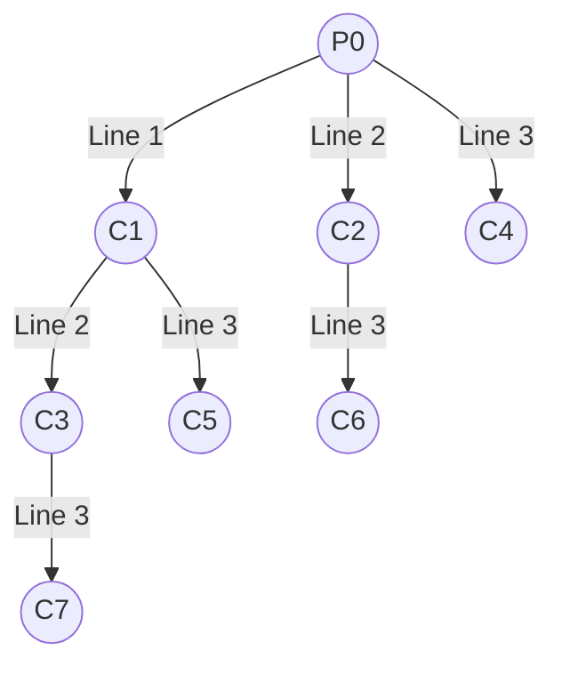

# Problem — Fork Execution Tree and Process Tracing

> 📖 **Reading Order:** Step 11 of 34 | **Module 2:** Processes & Threads  
> ◄ **Previous:** [[Process Forking and Zombie Orphan Example]] | ► **Next:** [[CPU Scheduling Principles and Criteria]]

---

## Problem Statement

Analyze the following four POSIX C code snippets and answer the corresponding tracing questions:

### Part 1: Sequential Fork Calls
```c
#include <stdio.h>
#include <unistd.h>

int main() {
    fork(); // Line 1
    fork(); // Line 2
    fork(); // Line 3
    printf("Hello\n");
    return 0;
}
```
1. How many total processes (including the original parent) are created by the end of execution?
2. How many new child processes were created?
3. How many times will `"Hello"` be printed to standard output?
4. Draw the complete process execution tree.

---

### Part 2: Loop-Based Forking
```c
#include <stdio.h>
#include <unistd.h>

int main() {
    for (int i = 0; i < 3; i++) {
        fork();
        printf("Iteration %d, PID: %d\n", i, getpid());
    }
    return 0;
}
```
1. What is the total number of lines printed to standard output?
2. How many times is `"Iteration 0"`, `"Iteration 1"`, and `"Iteration 2"` printed?

---

### Part 3: Short-Circuit Boolean Forking
```c
#include <stdio.h>
#include <unistd.h>

int main() {
    if (fork() && fork()) {
        fork();
    }
    printf("Done\n");
    return 0;
}
```
1. Trace the short-circuit evaluation of the logical AND (`&&`) operator across parent and child processes.
2. How many total processes are generated?
3. How many times is `"Done"` printed?

---

## Prerequisites & Relevant Concepts

- [[Process Creation and Termination Operations]] — Mechanics of `fork()` and return values.
- [[Process Forking and Zombie Orphan Example]] — Address space duplication.
- C logical short-circuit rules (`&&` stops if first operand is false/0; `||` stops if first operand is true/non-zero).

---

## Full Step-by-Step Solution

### Solution to Part 1: Sequential Fork Calls

#### 1. General Formula:
For $k$ consecutive, unconditional `fork()` calls executed in sequence:
$$\text{Total Processes} = 2^k$$
$$\text{New Child Processes Created} = 2^k - 1$$

Here $k = 3$:
- **Total Processes:** $2^3 = 8 \text{ processes}$.
- **New Child Processes:** $2^3 - 1 = 7 \text{ child processes}$.
- **Prints of "Hello":** Exactly $8 \text{ times}$ (each of the 8 processes reaches line 7).

#### 2. Process Tree Diagram:
Let $P_0$ be the root parent process:
- **Line 1 (`fork()`):** $P_0$ creates $C_1$. (Active: $P_0, C_1$ $\to$ 2 processes).
- **Line 2 (`fork()`):**
  - $P_0$ creates $C_2$.
  - $C_1$ creates $C_3$.
  (Active: $P_0, C_1, C_2, C_3$ $\to$ 4 processes).
- **Line 3 (`fork()`):**
  - $P_0$ creates $C_4$.
  - $C_1$ creates $C_5$.
  - $C_2$ creates $C_6$.
  - $C_3$ creates $C_7$.
  (Active: $P_0, C_1, C_2, C_3, C_4, C_5, C_6, C_7$ $\to$ 8 processes).



---

### Solution to Part 2: Loop-Based Forking

Let us trace iteration by iteration:
- **At start ($i = 0$):** 1 process ($P_0$).
  - `fork()` executes $\implies P_0$ creates 1 child. Now **2 processes** exist.
  - Both processes print `"Iteration 0"` $\implies$ **2 prints**.
- **Next ($i = 1$):** Both 2 processes enter the loop.
  - Each calls `fork()` $\implies 2 \times 2 = \mathbf{4\text{ processes}}$ exist.
  - All 4 processes print `"Iteration 1"` $\implies$ **4 prints**.
- **Next ($i = 2$):** All 4 processes enter the loop.
  - Each calls `fork()` $\implies 4 \times 2 = \mathbf{8\text{ processes}}$ exist.
  - All 8 processes print `"Iteration 2"` $\implies$ **8 prints**.

#### Summary Table:
- Total lines printed: $2 + 4 + 8 = 14 \text{ lines}$.
- `"Iteration 0"` is printed: $2^1 = 2 \text{ times}$.
- `"Iteration 1"` is printed: $2^2 = 4 \text{ times}$.
- `"Iteration 2"` is printed: $2^3 = 8 \text{ times}$.
- In general, for a loop of $N$ iterations, the total number of print executions is:
  $$\sum_{i=1}^N 2^i = 2^{N+1} - 2$$
  For $N = 3$: $2^4 - 2 = 16 - 2 = 14$.

---

### Solution to Part 3: Short-Circuit Boolean Forking

Recall the return value of `fork()`:
- In the **Parent**: returns positive non-zero PID ($\text{Evaluates to TRUE in C}$).
- In the **Child**: returns 0 ($\text{Evaluates to FALSE in C}$).

Recall C's **Short-Circuit Evaluation** for `A && B`:
- If `A` is `FALSE` (0), the entire expression is known to be `FALSE`; `B` is **NEVER executed**!
- If `A` is `TRUE` (non-zero), `B` **must be executed** to determine the truth value.

Let us trace step-by-step:
1. **Initial Process:** Process $P_0$ begins.
2. **First Fork in `if` (`A = fork()`):**
   - $P_0$ executes `fork()` and creates child $C_1$.
   - **In Child $C_1$:** `A = 0` (FALSE).
     - Because $C_1$ sees FALSE, short-circuit triggers! $C_1$ **skips the second `fork()`**.
     - The `if` condition evaluates to FALSE for $C_1$.
     - $C_1$ jumps directly to `printf("Done\n");`.
   - **In Parent $P_0$:** `A > 0` (TRUE).
     - Because `A` is TRUE, short-circuit does not apply. $P_0$ **must evaluate the second operand `B = fork()`**!
3. **Second Fork in `if` (`B = fork()`):**
   - $P_0$ executes `fork()` and creates child $C_2$.
   - **In Child $C_2$:** `B = 0` (FALSE).
     - The condition `(TRUE && FALSE)` evaluates to FALSE.
     - $C_2$ skips the `if` body and jumps directly to `printf("Done\n");`.
   - **In Parent $P_0$:** `B > 0` (TRUE).
     - The condition `(TRUE && TRUE)` evaluates to TRUE!
     - $P_0$ **enters the body of the `if` statement**.
4. **Third Fork inside `if` body (`fork()`):**
   - Inside the body, $P_0$ calls `fork()`, creating child $C_3$.
   - Both $P_0$ and $C_3$ finish the `if` body and proceed to `printf("Done\n");`.

```mermaid
flowchart TD
    P0["P0 executes: A = fork()"]
    P0 -->|Child: A=0 (FALSE)| C1["C1: Short-circuit! Skips B. if=FALSE"]
    P0 -->|Parent: A>0 (TRUE)| P0_eval["P0: Must evaluate B = fork()"]
    
    P0_eval -->|Child: B=0 (FALSE)| C2["C2: if=FALSE (skips body)"]
    P0_eval -->|Parent: B>0 (TRUE)| P0_body["P0: if=TRUE (enters body)"]
    
    P0_body -->|fork() inside body| C3["C3 created inside body"]
    P0_body --> P0_done["P0 reaches Done"]
    
    C1 --> Done1["Done (Printed by C1)"]
    C2 --> Done2["Done (Printed by C2)"]
    C3 --> Done3["Done (Printed by C3)"]
    P0_done --> Done4["Done (Printed by P0)"]
```

#### Final Counts for Part 3:
- **Total Processes:** Exactly **4 processes** ($P_0, C_1, C_2, C_3$).
- **Times "Done" is Printed:** Exactly **4 times**.

---

## Common Pitfalls

1. **Ignoring Short-Circuit:** Assuming that `fork() && fork()` always creates 4 processes. The child of the first fork *never* executes the second fork!
2. **Buffer Flushing Artifacts:**
   - If `printf("Hello")` does not contain a newline `\n` and output is redirected to a file, C standard I/O buffers the text in user space. During `fork()`, the unflushed buffer is cloned into the child, causing `"Hello"` to be printed twice as many times as expected! (Always use `\n` or `fflush(stdout)` in tracing problems).

---

## Sources & Traceability

- **Lectures:** `cse313/01 - Sources/Lectures/2. ProcessAndThread-week2-RRR.pdf` (Slides 22–28)
- **Question ID:** `Q-CSE313-001`
