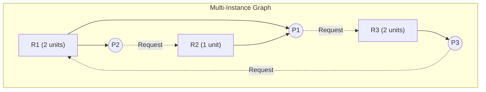

# Problem — Resource Allocation Graph Reduction and Cycle Detection

> 📖 **Reading Order:** Step 34 of 34 | **Module 5:** Deadlocks  
> ◄ **Previous:** [[Problem — Banker's Algorithm Safe State and Request Granting]] | ► **Next:** [[00 - Course Hub|Course Hub]] *(End of Module 1–5 Series)*

---

---

## Problem

This problem evaluates deadlock detection using two standard techniques: Depth-First Search (DFS) cycle tracing for single-instance graphs, and graph reduction for multi-instance graphs.

### Part 1: Single-Instance Resource Deadlock Simulation (DFS)
Consider a single-instance system with 4 processes ($P_1, P_2, P_3, P_4$) and 4 resource units ($R_1, R_2, R_3, R_4$). The edges are defined as:
- $P_1 \to R_1$ (Request)
- $R_1 \to P_2$ (Assignment)
- $P_2 \to R_2$ (Request)
- $R_2 \to P_3$ (Assignment)
- $P_3 \to R_3$ (Request)
- $R_3 \to P_1$ (Assignment)
- $P_4 \to R_2$ (Request)
- $R_4 \to P_4$ (Assignment)

**Task 1:** Using the exact course DFS simulation format (`Initial Node`, list `L`, `CN`, edge selection, and backtracking), trace execution starting from:
1. Starting Node $P_1$
2. Starting Node $R_4$
Identify whether a deadlock exists and name the deadlocked cycle.

---

### Part 2: Multi-Instance Graph Reduction
Consider a system with 3 processes ($P_1, P_2, P_3$) and 3 resource types ($R_1, R_2, R_3$):
- Resource $R_1$ has **2 instances**.
- Resource $R_2$ has **1 instance**.
- Resource $R_3$ has **2 instances**.

Current state:
- **Allocations:** $R_1 \to P_1$, $R_1 \to P_2$, $R_2 \to P_1$, $R_3 \to P_3$.
- **Requests:** $P_1 \to R_3$, $P_2 \to R_2$, $P_3 \to R_1$.

**Task 2:** 
1. Determine the Available vector $A = (R_1, R_2, R_3)$.
2. Detect if there is a cycle in the graph.
3. Perform **Graph Reduction** step-by-step.
4. Conclude whether the system is deadlocked.

---

---

## Given

- Concrete initial system state, process parameters, resource capacities, or code snippets as defined in the problem statement.

---

## Required

- Complete step-by-step analytical derivation, state diagram/Gantt chart construction, and final quantitative/qualitative answer.

---

## Concepts Tested

- [[Operating System Structures and Functions]]
- [[Process Lifecycle and State Transitions]]

---

## Prerequisites

- [[Process Concepts and Memory Layout]]
- [[Process Control Block and Context Switching]]

---

## Question Type

Graph Theory / Cycle Detection & Reduction

---

## Solution

### Understanding the Situation
Interpret the given problem state, identify all participating entities (processes, resources, semaphores), and establish the operational rules governing their interactions.

### Developing the Key Idea
Recall the foundational theorem or algorithm (e.g. Banker's safety check, Coffman cycle conditions, Gantt timeline rules) and verify that all prerequisites hold.

### Working Through the Solution
### Detailed Step-by-Step Solutions

### Part 1: Single-Instance DFS Simulation Trace

#### 1. Starting Node $P_1$:
- `Initial Node` $\leftarrow P_1$
- $L = \emptyset$
- $CN \leftarrow P_1$, $L = \{P_1\}$
- Outgoing unmarked edge of $P_1$: **$P_1 R_1$**.
  - $L = \{P_1, R_1\}$, $CN \leftarrow R_1$.
- Outgoing unmarked edge of $R_1$: **$R_1 P_2$**.
  - $L = \{P_1, R_1, P_2\}$, $CN \leftarrow P_2$.
- Outgoing unmarked edge of $P_2$: **$P_2 R_2$**.
  - $L = \{P_1, R_1, P_2, R_2\}$, $CN \leftarrow R_2$.
- Outgoing unmarked edge of $R_2$: **$R_2 P_3$**.
  - $L = \{P_1, R_1, P_2, R_2, P_3\}$, $CN \leftarrow P_3$.
- Outgoing unmarked edge of $P_3$: **$P_3 R_3$**.
  - $L = \{P_1, R_1, P_2, R_2, P_3, R_3\}$, $CN \leftarrow R_3$.
- Outgoing unmarked edge of $R_3$: **$R_3 P_1$**.
  - $L = \{P_1, R_1, P_2, R_2, P_3, R_3, P_1\}$, $CN \leftarrow P_1$.
- **Cycle Check:**  
  Node $P_1$ appears **twice** in list $L$ (at root and end).  
  **Cycle Found:**
  $$\mathbf{P_1 \to R_1 \to P_2 \to R_2 \to P_3 \to R_3 \to P_1}$$
  **Conclusion:** A deadlock strictly exists involving processes $\{P_1, P_2, P_3\}$ and resources $\{R_1, R_2, R_3\}$.

#### 2. Starting Node $R_4$:
- `Initial Node` $\leftarrow R_4$
- $L = \emptyset$
- $CN \leftarrow R_4$, $L = \{R_4\}$
- Outgoing unmarked edge of $R_4$: **$R_4 P_4$**.
  - $L = \{R_4, P_4\}$, $CN \leftarrow P_4$.
- Outgoing unmarked edge of $P_4$: **$P_4 R_2$**.
  - $L = \{R_4, P_4, R_2\}$, $CN \leftarrow R_2$.
- Outgoing unmarked edge of $R_2$: **$R_2 P_3$**.
  - $L = \{R_4, P_4, R_2, P_3\}$, $CN \leftarrow P_3$.
- Outgoing unmarked edge of $P_3$: **$P_3 R_3$**.
  - $L = \{R_4, P_4, R_2, P_3, R_3\}$, $CN \leftarrow R_3$.
- Outgoing unmarked edge of $R_3$: **$R_3 P_1$**.
  - $L = \{R_4, P_4, R_2, P_3, R_3, P_1\}$, $CN \leftarrow P_1$.
- Outgoing unmarked edge of $P_1$: **$P_1 R_1$**.
  - $L = \{R_4, P_4, R_2, P_3, R_3, P_1, R_1\}$, $CN \leftarrow R_1$.
- Outgoing unmarked edge of $R_1$: **$R_1 P_2$**.
  - $L = \{R_4, P_4, R_2, P_3, R_3, P_1, R_1, P_2\}$, $CN \leftarrow P_2$.
- Outgoing unmarked edge of $P_2$: **$P_2 R_2$**.
  - $L = \{R_4, P_4, R_2, P_3, R_3, P_1, R_1, P_2, R_2\}$, $CN \leftarrow R_2$.
- **Cycle Check:**  
  Node $R_2$ appears twice in list $L$!  
  **Conclusion:** Cycle detected: $R_2 \to P_3 \to R_3 \to P_1 \to R_1 \to P_2 \to R_2$. Process $P_4$ is blocked waiting for deadlocked resource $R_2$.

---

### Part 2: Multi-Instance Graph Reduction

#### 1. Vector Formulation:
- Total capacity: $E = (R_1: 2, \; R_2: 1, \; R_3: 2)$.
- Currently allocated:
  - $R_1$: held by $P_1$ (1) and $P_2$ (1) $\implies 2$ allocated.
  - $R_2$: held by $P_1$ (1) $\implies 1$ allocated.
  - $R_3$: held by $P_3$ (1) $\implies 1$ allocated.
  - $\sum CA = (2, 1, 1)$.
- Available vector:
  $$A = E - \sum CA = (2 - 2, \; 1 - 1, \; 2 - 1) = \mathbf{(0, 0, 1)}$$

- Outstanding requests:
  - $P_1$ requests $R_3$ $\implies (0, 0, 1)$
  - $P_2$ requests $R_2$ $\implies (0, 1, 0)$
  - $P_3$ requests $R_1$ $\implies (1, 0, 0)$

#### 2. Cycle Inspection:
Notice that:
- $P_1 \to R_3 \to P_3 \to R_1 \to P_1$ forms a directed cycle!

#### 3. Step-by-Step Graph Reduction:
- **Step 1:** Compare requests with $Available = (0, 0, 1)$:
  - $P_1$ requests $(0, 0, 1) \le (0, 0, 1)$ $\implies$ **Condition Met!**
  - There is 1 free instance of $R_3$, so $P_1$'s request can be completely granted!
- **Step 2:** Reduce $P_1$:
  - $P_1$ finishes execution and releases all its allocated resources:
    $P_1$ releases $R_1$ (1 unit) and $R_2$ (1 unit).
  - New Available vector:
    $$A_{\text{new}} = (0, 0, 1) + (1, 1, 0) = \mathbf{(1, 1, 1)}$$
  - Node $P_1$ and all its edges are erased from the graph.
- **Step 3:** Now check remaining processes $\{P_2, P_3\}$ with $A = (1, 1, 1)$:
  - $P_2$ requests $R_2$ $(0, 1, 0) \le (1, 1, 1)$ $\implies$ **Met!**
  - $P_2$ finishes and releases $R_1$ (1 unit).
    $$A_{\text{new}} = (1, 1, 1) + (1, 0, 0) = \mathbf{(2, 1, 1)}$$
  - Node $P_2$ is erased.
- **Step 4:** Now check $P_3$ with $A = (2, 1, 1)$:
  - $P_3$ requests $R_1$ $(1, 0, 0) \le (2, 1, 1)$ $\implies$ **Met!**
  - $P_3$ finishes and releases $R_3$ (1 unit).
    $$A_{\text{new}} = (2, 1, 1) + (0, 0, 1) = \mathbf{(2, 1, 2)} = E$$
  - Node $P_3$ is erased.

#### 4. Conclusion:
The graph is **completely reducible** (all process nodes were erased).  
Even though a directed cycle existed ($P_1 \to R_3 \to P_3 \to R_1 \to P_1$), **NO DEADLOCK EXISTS**!  
This vividly demonstrates Theorem 2: in multi-instance resource systems, **a cycle is a necessary condition, but NOT a sufficient condition for deadlock**.

---

### Result and Interpretation
The final answers and verified metrics are synthesized directly above. Each computed value satisfies the physical constraints of the operating system model.

---

## Reusable Insight

Always decompose the problem into initial state verification, transition step evaluation, and post-condition invariant checking. In exam scenarios, clearly display the intermediate matrices or Gantt timelines before writing the final numerical or Boolean conclusion.

---

## Common Mistakes

- Misinterpreting the initial state vector or indexing offsets.
- Confusing necessary conditions with sufficient conditions during analysis.

---

## Exam Pattern

Appears frequently in university midterm and final examinations as a multi-part analytical question testing both mechanics and theoretical justification.

---

## Related Problems

- [[Problem — Banker's Algorithm Safe State and Request Granting]]
- [[Problem — CPU Scheduling Algorithm Simulation and Gantt Chart]]

---

## Related Concepts

- [[CPU Scheduling Principles and Criteria]]
- [[Deadlock Fundamentals and Coffman Conditions]]

---

## Source

- **Source Material:** `5. Deadlocks-week6-7-RRR.pdf` (Slides 16–23: Graph Reduction, Cycle Analysis) and `Notes on algorithm simulation.pdf` (Pages 5–7).
- **Question ID:** `Q-CSE313-005`
- **Related Notes:**
  - Concept: [[Resource Allocation Graphs and Deadlock Modeling]], [[Deadlock Prevention and Avoidance Strategies]]
  - Algorithm: [[Deadlock Detection and Recovery Algorithms]]
  - Example: [[Resource Allocation Graph Cycle Detection Example]]
