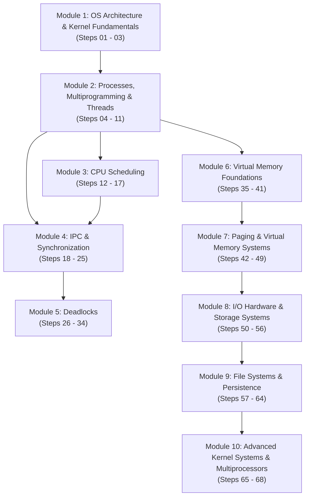

# CSE313 — Dependency Map

This map visualizes the conceptual prerequisites, algorithmic foundations, and learning pathways across all ten operating systems modules.

---

## 1. High-Level Modular Learning Flow

---

## 2. Detailed Topic Dependency Graph

```mermaid
flowchart TD
    %% Module 1
    OS["Operating System Structures & Functions"] --> DM["Dual-Mode Operation & System Calls"]
    DM --> BOOT["Computer Booting & Hardware Abstractions"]

    %% Module 2
    DM --> PROC["Process Concepts & Memory Layout"]
    PROC --> LIFE["Process Lifecycle & State Transitions"]
    LIFE --> PCB["Process Control Block & Context Switching"]
    PCB --> OPS["Process Creation & Termination (fork/exec)"]
    OPS --> THR["Threads & Multithreading Models"]
    LIFE --> FORM_UTIL["CPU Multiprogramming Formula"]
    OPS --> EX_FORK["Process Forking & Zombie Example"]
    EX_FORK --> PROB_FORK["Problem — Fork Tree Tracing (Q-001)"]

    %% Module 3
    LIFE --> SCHED_CRIT["CPU Scheduling Principles & Criteria"]
    SCHED_CRIT --> BATCH["Batch Scheduling (FCFS, SJF, SRTF)"]
    SCHED_CRIT --> INTER["Interactive Scheduling (RR, Priority, MLFQ)"]
    BATCH --> FORM_BURST["Scheduling Metrics & Burst Formulas"]
    INTER --> FORM_BURST
    FORM_BURST --> EX_SCHED["CPU Scheduling Simulation Example"]
    EX_SCHED --> PROB_SCHED["Problem — CPU Scheduling & Gantt (Q-002)"]

    %% Module 4
    PCB --> RACE["Race Conditions & Critical Section Problem"]
    THR --> RACE
    RACE --> PETERSON["Peterson's Algorithm & TSL/XCHG"]
    RACE --> SEM["Semaphores & Synchronization Primitives"]
    SEM --> MON["Monitors & Condition Variables"]
    SEM --> MSG["Message Passing & IPC Models"]
    SEM --> CLASSIC["Classic Synchronization Solutions"]
    CLASSIC --> EX_PROD["Producer-Consumer Semaphore Example"]
    CLASSIC --> PROB_PHIL["Problem — Dining Philosophers (Q-003)"]

    %% Module 5
    RACE --> DEAD_FUND["Deadlock Fundamentals & Coffman Conditions"]
    CLASSIC --> DEAD_FUND
    DEAD_FUND --> RAG["Resource Allocation Graphs & Modeling"]
    DEAD_FUND --> PREV["Deadlock Prevention & Avoidance"]
    PREV --> BANKER["Banker's Algorithm"]
    RAG --> DETECT["Deadlock Detection & Recovery"]
    BANKER --> EX_BANK["Banker's Algorithm Simulation Example"]
    DETECT --> EX_RAG["RAG Cycle Detection DFS Example"]
    EX_BANK --> PROB_BANK["Problem — Banker's Algorithm (Q-004)"]
    EX_RAG --> PROB_RAG["Problem — RAG Reduction & Cycles (Q-005)"]

    %% Module 6
    PROC --> AS_RELOC["Address Space Abstraction & Hardware Relocation"]
    AS_RELOC --> MEM_API["Memory API & Allocation Safety"]
    AS_RELOC --> SEG["Segmentation & External Fragmentation"]
    MEM_API --> FREE_SPACE["Free-Space Management & Allocation Policies"]
    FREE_SPACE --> BUDDY["Segregated Lists & Binary Buddy Allocation"]
    SEG --> EX_SEG["Segmentation & Buddy Allocation Example"]
    BUDDY --> EX_SEG
    EX_SEG --> PROB_SEG["Problem — Segmentation & Buddy Allocation (Q-006)"]

    %% Module 7
    SEG --> PAGE_INTRO["Paging Architecture & Linear Page Tables"]
    PAGE_INTRO --> TLB["Translation Lookaside Buffers & Hardware Caching"]
    PAGE_INTRO --> MULTI_PAGE["Multi-Level Page Tables & Advanced Translation"]
    PAGE_INTRO --> SWAP_MECH["Swapping Mechanisms & Page Fault Handling"]
    SWAP_MECH --> PAGE_POL["Page Replacement Policies & Clock Algorithm"]
    PAGE_POL --> FORM_VM["Virtual Memory Performance Formulas"]
    MULTI_PAGE --> EX_PAGE["Two-Level Paging & Clock Example"]
    PAGE_POL --> EX_PAGE
    EX_PAGE --> PROB_PAGE["Problem — Multi-Level Paging & Replacement (Q-007)"]

    %% Module 8
    DM --> IO_ARCH["IO System Architecture & Direct Memory Access"]
    IO_ARCH --> HDD["Hard Disk Drive Architecture & Mechanical Latency"]
    HDD --> DISK_SCHED["Disk Arm Scheduling Algorithms"]
    HDD --> RAID["RAID Architectures & Redundancy Models"]
    RAID --> FORM_DISK["Disk Latency & RAID Performance Formulas"]
    DISK_SCHED --> EX_DISK["Disk Scheduling & RAID Small-Write Example"]
    RAID --> EX_DISK
    EX_DISK --> PROB_DISK["Problem — Disk Scheduling & RAID Analysis (Q-008)"]

    %% Module 9
    HDD --> FILE_API["File & Directory Abstractions & POSIX API"]
    FILE_API --> VSFS["File System Implementation & VSFS Structures"]
    VSFS --> FFS["Locality & Berkeley Fast File System (FFS)"]
    VSFS --> CRASH["Crash Consistency, FSCK & Journaling"]
    CRASH --> LFS["Log-Structured File Systems (LFS)"]
    VSFS --> EX_FS["VSFS Inode Lookup & Journaling Example"]
    CRASH --> EX_FS
    LFS --> EX_LFS["LFS Segment Allocation & Imap Example"]
    EX_FS --> PROB_FS["Problem — File System Inodes & Journaling (Q-009)"]

    %% Module 10
    BUDDY --> SLAB["Kernel Memory Allocation & Slab Allocator"]
    THR --> MULTI_CPU["Multiprocessor Operating System Architectures"]
    MSG --> LINUX_RPC["Linux System Architecture & RPC"]
    MULTI_CPU --> PROB_MULTI["Problem — Multiprocessor Latency & Slabs (Q-010)"]
    SLAB --> PROB_MULTI
```

---

## 3. Prerequisite Matrix

| Knowledge Note | Direct Prerequisites | Unlocks / Enables |
|---|---|---|
| [[Dual-Mode Operation and System Calls]] | [[Operating System Structures and Functions]] | [[Process Concepts and Memory Layout]], [[Process Control Block and Context Switching]], [[IO System Architecture and Direct Memory Access]] |
| [[Process Lifecycle and State Transitions]] | [[Process Concepts and Memory Layout]] | [[CPU Scheduling Principles and Criteria]], [[Process Control Block and Context Switching]] |
| [[Threads and Multithreading Models]] | [[Process Concepts and Memory Layout]] | [[Race Conditions and Critical-Section Problem]], [[Multiprocessor Operating System Architectures]] |
| [[CPU Scheduling Principles and Criteria]] | [[Process Lifecycle and State Transitions]] | [[Batch Scheduling Algorithms]], [[Interactive Scheduling Algorithms]] |
| [[Race Conditions and Critical-Section Problem]] | [[Threads and Multithreading Models]], [[Process Control Block and Context Switching]] | [[Peterson's Algorithm and Hardware Mutual Exclusion]], [[Semaphores and Synchronization Primitives]] |
| [[Semaphores and Synchronization Primitives]] | [[Race Conditions and Critical-Section Problem]] | [[Monitors and Condition Variables]], [[Classic Synchronization Solutions]] |
| [[Deadlock Fundamentals and Coffman Conditions]] | [[Semaphores and Synchronization Primitives]], [[Classic Synchronization Solutions]] | [[Resource Allocation Graphs and Deadlock Modeling]], [[Deadlock Prevention and Avoidance Strategies]] |
| [[Banker's Algorithm]] | [[Deadlock Prevention and Avoidance Strategies]] | [[Banker's Algorithm Multi-Resource Step-by-Step Example]], [[Problem — Banker's Algorithm Safe State and Request Granting]] |
| [[Deadlock Detection and Recovery Algorithms]] | [[Resource Allocation Graphs and Deadlock Modeling]] | [[Resource Allocation Graph Cycle Detection Example]], [[Problem — Resource Allocation Graph Reduction and Cycle Detection]] |
| [[Address Space Abstraction and Hardware Relocation]] | [[Dual-Mode Operation and System Calls]], [[Process Concepts and Memory Layout]] | [[Memory API and Allocation Safety]], [[Segmentation and External Fragmentation]] |
| [[Segmentation and External Fragmentation]] | [[Address Space Abstraction and Hardware Relocation]] | [[Free-Space Management and Allocation Policies]], [[Paging Architecture and Linear Page Tables]] |
| [[Free-Space Management and Allocation Policies]] | [[Memory API and Allocation Safety]], [[Segmentation and External Fragmentation]] | [[Segregated Free Lists and Binary Buddy Allocation]], [[Kernel Memory Allocation Architecture and the Slab Allocator]] |
| [[Paging Architecture and Linear Page Tables]] | [[Segmentation and External Fragmentation]] | [[Translation Lookaside Buffers and Hardware Caching]], [[Multi-Level Page Tables and Advanced Address Translation]], [[Swapping Mechanisms and Page Fault Handling]] |
| [[Translation Lookaside Buffers and Hardware Caching]] | [[Paging Architecture and Linear Page Tables]] | [[Multi-Level Page Tables and Advanced Address Translation]], [[Virtual Memory Performance and Address Translation Formulas]] |
| [[Swapping Mechanisms and Page Fault Handling]] | [[Paging Architecture and Linear Page Tables]], [[Multi-Level Page Tables and Advanced Address Translation]] | [[Page Replacement Policies and the Clock Algorithm]], [[Virtual Memory Performance and Address Translation Formulas]] |
| [[IO System Architecture and Direct Memory Access]] | [[Dual-Mode Operation and System Calls]], [[Process Control Block and Context Switching]] | [[Hard Disk Drive Architecture and Mechanical Latency]] |
| [[Hard Disk Drive Architecture and Mechanical Latency]] | [[IO System Architecture and Direct Memory Access]] | [[Disk Arm Scheduling Algorithms]], [[RAID Architectures and Redundancy Models]], [[File and Directory Abstractions and POSIX File API]] |
| [[File System Implementation and VSFS On-Disk Structures]] | [[File and Directory Abstractions and POSIX File API]], [[Hard Disk Drive Architecture and Mechanical Latency]] | [[Locality and the Berkeley Fast File System (FFS)]], [[Crash Consistency, FSCK, and Write-Ahead Journaling]] |
| [[Crash Consistency, FSCK, and Write-Ahead Journaling]] | [[File System Implementation and VSFS On-Disk Structures]] | [[Log-Structured File Systems (LFS) and Segment Cleaning]], [[Problem — File System Inode Capacity and Journaling Recovery]] |
| [[Kernel Memory Allocation Architecture and the Slab Allocator]] | [[Free-Space Management and Allocation Policies]], [[Segregated Free Lists and Binary Buddy Allocation]] | [[Problem — Multiprocessor Memory Latency and Kernel Memory Allocation]] |
| [[Multiprocessor Operating System Architectures]] | [[Threads and Multithreading Models]], [[Race Conditions and Critical-Section Problem]] | [[Problem — Multiprocessor Memory Latency and Kernel Memory Allocation]] |
| [[Linux System Architecture and Remote Procedure Calls (RPC)]] | [[Message Passing and IPC Models]], [[Dual-Mode Operation and System Calls]] | [[Problem — Multiprocessor Memory Latency and Kernel Memory Allocation]] |
