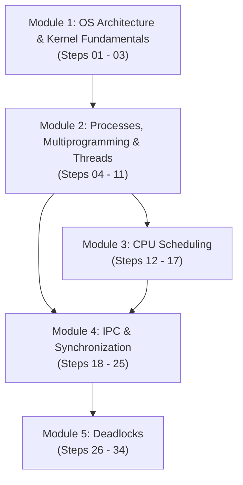
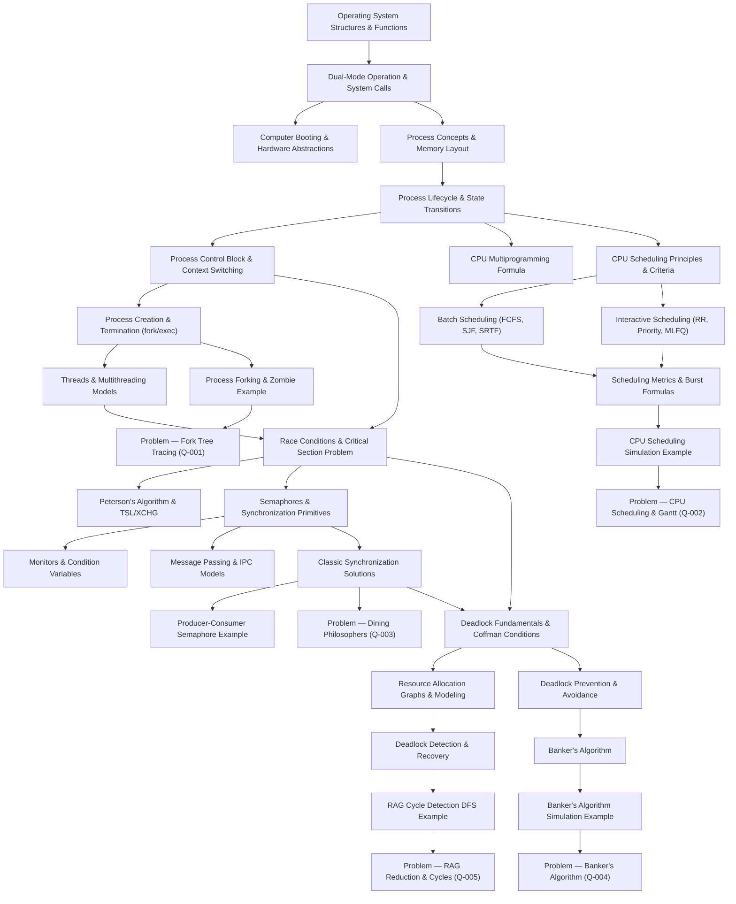

# CSE313 — Dependency Map

This map visualizes the conceptual prerequisites, algorithmic foundations, and learning pathways across all five operating systems modules.

---

## 1. High-Level Modular Learning Flow

---

## 2. Detailed Topic Dependency Graph

---

## 3. Prerequisite Matrix

| Knowledge Note | Direct Prerequisites | Unlocks / Enables |
|---|---|---|
| [[Dual-Mode Operation and System Calls]] | [[Operating System Structures and Functions]] | [[Process Concepts and Memory Layout]], [[Process Control Block and Context Switching]] |
| [[Process Lifecycle and State Transitions]] | [[Process Concepts and Memory Layout]] | [[CPU Scheduling Principles and Criteria]], [[Process Control Block and Context Switching]] |
| [[Threads and Multithreading Models]] | [[Process Concepts and Memory Layout]] | [[Race Conditions and Critical-Section Problem]] |
| [[CPU Scheduling Principles and Criteria]] | [[Process Lifecycle and State Transitions]] | [[Batch Scheduling Algorithms]], [[Interactive Scheduling Algorithms]] |
| [[Race Conditions and Critical-Section Problem]] | [[Threads and Multithreading Models]], [[Process Control Block and Context Switching]] | [[Peterson's Algorithm and Hardware Mutual Exclusion]], [[Semaphores and Synchronization Primitives]] |
| [[Semaphores and Synchronization Primitives]] | [[Race Conditions and Critical-Section Problem]] | [[Monitors and Condition Variables]], [[Classic Synchronization Solutions]] |
| [[Deadlock Fundamentals and Coffman Conditions]] | [[Semaphores and Synchronization Primitives]], [[Classic Synchronization Solutions]] | [[Resource Allocation Graphs and Deadlock Modeling]], [[Deadlock Prevention and Avoidance Strategies]] |
| [[Banker's Algorithm]] | [[Deadlock Prevention and Avoidance Strategies]] | [[Banker's Algorithm Multi-Resource Step-by-Step Example]], [[Problem — Banker's Algorithm Safe State and Request Granting]] |
| [[Deadlock Detection and Recovery Algorithms]] | [[Resource Allocation Graphs and Deadlock Modeling]] | [[Resource Allocation Graph Cycle Detection Example]], [[Problem — Resource Allocation Graph Reduction and Cycle Detection]] |
