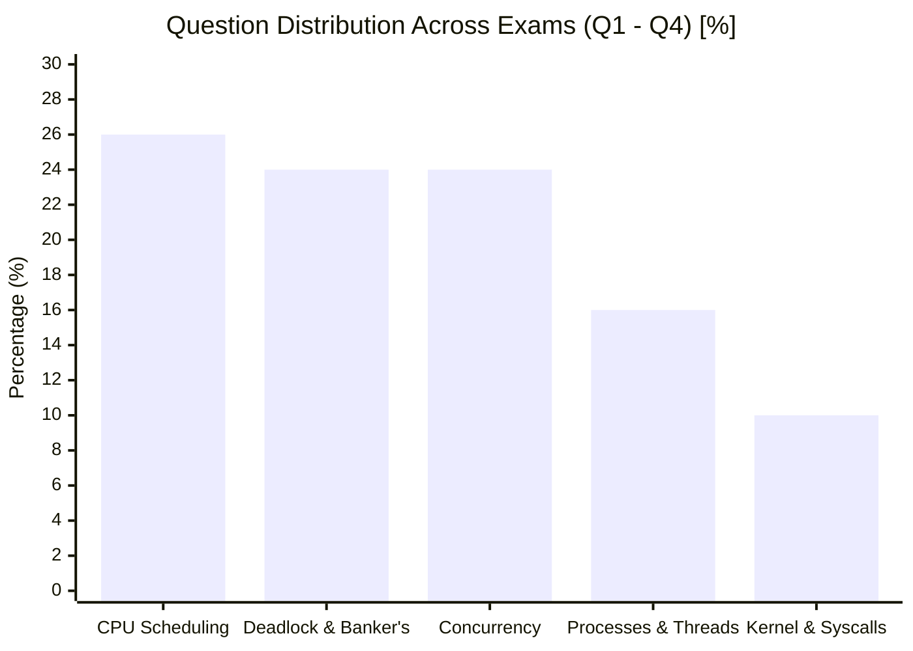

# Operating Systems Final Exam Intelligence (2017 – 2021)

This intelligence map analyzes recurring patterns, high-frequency question types, and conceptual weightings from the last 5 years of CSE313 final exams (2017–2021) across Questions 1 through 4.

### 📚 Year-Wise Solved Question Links:
- [[cse313/01 - Sources/Exams/Finals/Solutions/CSE313_2017_Solved_Questions_1_to_4|2017 Solved Exam (Q1 - Q4)]]
- [[cse313/01 - Sources/Exams/Finals/Solutions/CSE313_2018_Solved_Questions_1_to_4|2018 Solved Exam (Q1 - Q4)]]
- [[cse313/01 - Sources/Exams/Finals/Solutions/CSE313_2019_Solved_Questions_1_to_4|2019 Solved Exam (Q1 - Q4)]]
- [[cse313/01 - Sources/Exams/Finals/Solutions/CSE313_2020_Solved_Questions_1_to_4|2020 Solved Exam (Q1 - Q4)]]
- [[cse313/01 - Sources/Exams/Finals/Solutions/CSE313_2021_Solved_Questions_1_to_4|2021 Solved Exam (Q1 - Q4)]]

---

## 1. High-Frequency Exam Patterns (100% Recurrence)

Across all five exam years analyzed (2017, 2018, 2019, 2020, 2021), the first four questions consistently draw from the first five core modules:

---

## 2. Topic-by-Topic Exam Intelligence

### 🔹 Topic A: CPU Scheduling Simulation (Appeared Every Year: 2017, 2018, 2019, 2020, 2021)
- **Standard Format:** A table of 3–5 processes with Arrival Times, Burst Durations, and Priorities.
- **Algorithms Tested:**
  - Round Robin (RR) with explicit quantum sizes (e.g., $q=20\text{ s}$, $q=30\text{ s}$).
  - Priority Scheduling with RR tie-breaking within the same priority level.
  - Shortest Remaining Time First (SRTF) vs Non-preemptive SJF.
  - Handling multi-quantum rules (e.g., 2020: first 5 quanta $q=20$, subsequent quanta $q=30$).
  - Non-preemption clauses (e.g., 2021: once running, a process finishes its quantum before being preempted by higher priority).
- **Sub-Questions:**
  - Optimal batch ordering for jobs with bursts $9, 3, 5, X$ (Repeated verbatim in **2019 Q1(b)** and **2021 Q2(d)**!).
  - Convoy effect under FCFS (Repeated in **2020 Q2(a)** and **2021 Q2(b)**).
- **Core Note Links:**
  - [[Batch Scheduling Algorithms]]
  - [[Interactive Scheduling Algorithms]]
  - [[Comprehensive CPU Scheduling Simulation Example]]
  - [[Problem — CPU Scheduling Algorithm Simulation and Gantt Chart]]

---

### 🔹 Topic B: Concurrency, Synchronization & Classical Problems
- **1. Peterson's Algorithm & Priority Inversion:**
  - Explain priority inversion between high-priority $H$ and low-priority $L$ under spinlock/busy-wait.
  - *Follow-up question:* Does this priority inversion occur under Round Robin scheduling? (Repeated verbatim in **2018**, **2019 Q2(a)**, and **2021 Q4(a)**!).
  - *Answer key:* NO under RR, because the timer interrupt forcibly preempts $H$, giving CPU time to $L$ to finish its critical section.
  - Linked Note: [[Peterson's Algorithm and Hardware Mutual Exclusion]]
- **2. Dining Philosophers Bug Variations:**
  - Setting `state[i] = THINKING` *after* calling `test()` instead of before (Repeated verbatim in **2017 Q2(c)(i)** and **2021 Q4(b)(i)**!).
  - Placing `up(&s[i])` *outside* the `if` condition in `test(i)` (Repeated verbatim in **2017 Q2(c)(ii)** and **2021 Q4(b)(ii)**!).
  - Asymmetric odd/even philosopher ordering proof (**2019 Q2(b)**).
  - Linked Notes: [[Classic Synchronization Solutions]], [[Problem — Dining Philosophers Deadlock-Free Synchronization]]
- **3. Producer-Consumer & Monitor Semantics:**
  - The Lost Wakeup Call race condition in `sleep()` and `wakeup()` (**2017 Q2(d)**).
  - Mesa condition variables requiring `while` instead of `if` to prevent buffer underflow/overflow (**2018 Q3(c)**).
  - Linked Notes: [[Semaphores and Synchronization Primitives]], [[Monitors and Condition Variables]], [[Producer-Consumer Semaphore Implementation Example]]

---

### 🔹 Topic C: Deadlocks (Avoidance & Detection)
- **1. Dijkstra's Banker's Algorithm:**
  - Multi-resource safe state evaluation ($E, CA, MaxReq, A, R$) (Appeared in **2017 Q3(a)**, **2019 Q3(a)**, **2020 Q3(b)**, **2021 Q1(a)**).
  - *Notice:* **2019 Question 3(a)** is the exact numerical simulation problem from `Notes on algorithm simulation.pdf`!
  - Safe vs Unsafe state distinction (**2019 Q1(c)**, **2020 Q3(b)**, **2021 Q3(a)**).
  - Linked Notes: [[Banker's Algorithm]], [[Banker's Algorithm Multi-Resource Step-by-Step Example]], [[Problem — Banker's Algorithm Safe State and Request Granting]]
- **2. Resource Allocation Graphs (RAG) & DFS Cycle Detection:**
  - Tracing list $L$ and current node $CN$ using the DFS algorithm with backtracking from a given root (Appeared in **2017 Q3(c)**, **2020 Q3(a)**).
  - Scenario showing that deadlocked processes include processes outside the cycle (Repeated in **2019 Q3(b)** and **2020 Q3(c)**).
  - Linked Notes: [[Resource Allocation Graphs and Deadlock Modeling]], [[Deadlock Detection and Recovery Algorithms]], [[Resource Allocation Graph Cycle Detection Example]]
- **3. Deadlock Prevention:**
  - Attacking Circular Wait via linear resource ordering $F: R \to \mathbb{N}$ (**2019 Q3(c)**, **2021 Q1(c)**).
  - Linked Notes: [[Deadlock Prevention and Avoidance Strategies]]

---

### 🔹 Topic D: Processes, Threads & Fork Trees
- **1. Loop-based `fork()` Process Tree:**
  - `for (; i < 3; i++) fork();` with starting values of $i$ (Repeated verbatim in **2017 Q1(b)** and **2020 Q4(b)**!).
  - Creates 8 total processes ($P_0$ at $i=0$, $P_1$ at $i=0$, $P_2, P_3$ at $i=1$, $P_4..P_7$ at $i=2$).
  - Linked Note: [[Problem — Fork Execution Tree and Process Tracing]]
- **2. Process vs Thread Context Switching:**
  - Classifying per-process vs per-thread items (**2019 Q4(b)**).
  - Diagramming ULT vs KLT scheduler and tables to justify why KLT is superior for blocking I/O (**2017 Q1(d)**, **2019 Q4(c)**, **2020 Q2(c)**, **2021 Q1(b)**).
  - Linked Note: [[Threads and Multithreading Models]], [[Process Control Block and Context Switching]]

---

### 🔹 Topic E: OS Fundamentals, Syscalls & Boot Sequence
- **1. Booting Steps:** BIOS $\to$ POST $\to$ MBR $\to$ Bootloader Stage 1/2 $\to$ Mode Switch $\to$ Kernel Init (**2017 Q1(a)**, **2021 Q3(d)**).
- **2. Steps in Making a System Call:** Parameter marshaling $\to$ syscall number in register $\to$ trap instruction $\to$ mode switch $\to$ IDT lookup $\to$ kernel service $\to$ return from trap (**2017 Q1(c)**, **2019 Q4(a)**).
- **3. User vs Kernel Mode & Monolithic vs Microkernel:** (**2019 Q2(d)**, **2021 Q3(b)**).
- **Core Note Links:**
  - [[Operating System Structures and Functions]]
  - [[Dual-Mode Operation and System Calls]]
  - [[Computer Booting and Hardware Abstractions]]
